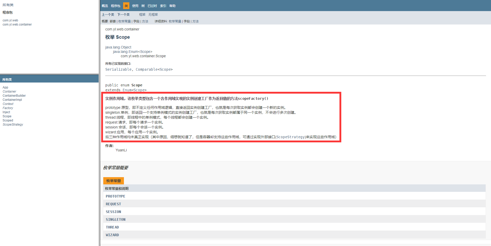

[本文部分摘自书籍《大话设计模式》](https://www.amazon.cn/dp/B00YXHUF10/ref=sr_1_4?s=books&ie=UTF8&qid=1525329136&sr=1-4&keywords=%E5%A4%A7%E8%AF%9D%E8%AE%BE%E8%AE%A1%E6%A8%A1%E5%BC%8F)  

### Java注释  

良好的注释能极大的提高代码的可读性，而且注释文档将被用于生成HTML代码报告，所以代码注释很重要，在写出良好的代码之前，写出标准的注释是或不可缺的。关于HTML代码报告，使用过maven（关于maven的笔记及总结可查看 [github](https://github.com/YuanLicc/maven-notes) 或者 [csdn](https://blog.csdn.net/b_boy_hong10/article/category/7533538) ）的javadoc插件的应该比较清楚，它会根据代码生成响应的API文档，形如：

  

#### 注释文档

写在类、域、构造函数、方法、定义之前的注释块被称为注释文档，举个例子：

```java
/**
* 将指定数组转换为List
* @author YuanLi
* @param array 目标数组
* @return List
**/
public List<T> toList(T[] array) {
    return null;
}
```

注释文档由两部分组成：

- 描述    
- 块标记  

块标记就是由@符号开头的串，除此以外为描述。  

#### 注释分类

- 文件头注释  

  - 描述部分

    注明类作用及相关信息。  

  - 块标记部分  

    必须注明作者、版本信息。  

- 构造函数注释  

  - 描述部分  

    注明构造函数的作用。  

  - 块标记部分  

    非必须。  

- 域注释  

  域注释可以出现在注释文档中，也可以不出现在注释文档中，域注释将会被认为是注释文档出现在最终生成的HTML报告中。

- 方法注释  

  - 描述部分  

    注明方法的功能。  

  - 标记块部分  

    注明方法参数、返回值、异常等信息。

- 定义注释  

  同域注释。

很显然，分类针对的是注释的位置而定的，所以很容易理解。  

#### 块标记顺序格式  

``` java
/*
* @param (classes, interfaces, methods, constructors) 
* @return (methods)
* @exception (@throws) 
* @author (classes, interfaces required) 
* @version (classes, interfaces: required) 
* @see (examples: @see java.util.List、java.util.List#add(Object))
* @since 
* @serial (@serialField, @serialData) 
* @deprecated (Deprecate APIs)
*/
```

关于块标记的含义不做多余的解释，因为其本身的含义已经表达了它的用途，去尝试一下就恍然大悟了。下面贴上`java.lang.String`的部分注释，请揣摩：

```java
/**
 * The {@code String} class represents character strings. All
 * string literals in Java programs, such as {@code "abc"}, are
 * implemented as instances of this class.
 * <p>
 * Here are some more examples of how strings can be used:
 * <blockquote><pre>
 *     System.out.println("abc");
 *     String cde = "cde";
 *     System.out.println("abc" + cde);
 *     String c = "abc".substring(2,3);
 *     String d = cde.substring(1, 2);
 * </pre></blockquote>
 * <p>
 *
 * @author  Lee Boynton
 * @author  Arthur van Hoff
 * @author  Martin Buchholz
 * @author  Ulf Zibis
 * @see     java.lang.Object#toString()
 * @see     java.lang.StringBuffer
 * @see     java.lang.StringBuilder
 * @see     java.nio.charset.Charset
 * @since   JDK1.0
 */

public final class String
    implements java.io.Serializable, Comparable<String>, CharSequence {
    
    /** The value is used for character storage. */
    private final char value[];
    
    /**
     * Initializes a newly created {@code String} object so that it represents
     * the same sequence of characters as the argument; in other words, the
     * newly created string is a copy of the argument string. Unless an
     * explicit copy of {@code original} is needed, use of this constructor is
     * unnecessary since Strings are immutable.
     *
     * @param  original
     *         A {@code String}
     */
    public String(String original) {
        this.value = original.value;
        this.hash = original.hash;
    }
    
    /**
     * Returns true if and only if this string contains the specified
     * sequence of char values.
     *
     * @param s the sequence to search for
     * @return true if this string contains {@code s}, false otherwise
     * @since 1.5
     */
    public boolean contains(CharSequence s) {
        return indexOf(s.toString()) > -1;
    }
}
```

#### 块标记重复顺序

``` java
/*
* @author（chronological按时间先后顺序） 
* @param（declaration按参数定义顺序） 
* @throws（alphabetically按异常名字的字母顺序） 
* @see 按如下顺序： 
* @see #field
* @see #Constructor( Type, Type...) 
* @see #Constructor( Type id, Type id...) 
* @see #method( Type, Type,...) 
* @see #method( Type id, Type, id...) 
* @see Class 
* @see Class#field 
* @see Class#Constructor( Type, Type...) 
* @see Class#Constructor( Type id, Type id)
* @see Class#method( Type, Type,...) 
* @see Class#method( Type id, Type id,...) 
* @see package.Class 
* @see package.Class#field 
* @see package.Class#Constructor( Type, Type...) 
* @see package.Class#Constructor( Type id, Type id)
* @see package.Class#method( Type, Type,...) 
* @see package.Class#method( Type id, Type, id) 
* @see package
*/
```

#### 其它

- @link  

  描述时可使用此来链接到其它方法、类、构造、字段等。其用法与@see的用法相同。 

-  其它标签  

  有很多这样的标签可用，没进行归纳。大多数都与HTML标签类似，可进行尝试（ul、li等标签都是可用的）。

  