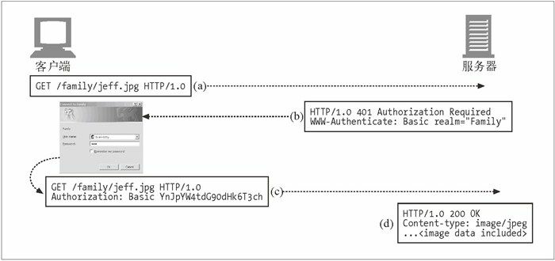

本文摘自书籍[《HTTP 权威指南》](https://www.amazon.cn/dp/B008XFDQ14/ref=sr_1_1?s=books&ie=UTF8&qid=1527513120&sr=1-1&keywords=http%E6%9D%83%E5%A8%81%E6%8C%87%E5%8D%97) 

## 基本认证机制

有数百万的人在用 Web 进行私人事务处理，访问私有的数据。通过 Web 可以很方便地访问这些信息，但仅仅是方便访问还是不够的。我们要保证只有特定的人能看到我们的敏感信息并且能够执行我们的特权事务。并不是所有的信息都能够公开发布的。未授权用户无法查看我们的在线旅游档案，也不能在未经许可的情况下向 Web 站点发布文档，这会让我们感觉舒服一些。我们还要确保，组织中未经授权或不怀好意的成员无法获取那些最敏感的公司计划文档。服务器需要通过某种方式来了解用户身份。一旦服务器知道了用户身份，就可以判定用户可以访问的事务和资源了。认证就意味着要证明你是谁。通常是通过提供用户名和密码来进行认证的。HTTP 为认证提供了一种原生工具。尽管我们可以在 HTTP 的认证形式和 cookie 基础之上“运行自己的”认证工具，但在很多情况下，HTTP 的原生认证功能就可以很好地满足要求。

### 认证

认证就是要给出一些身份证明。当出示像护照或驾照那样有照片的身份证件时，就给出了一些证据，说明你就是你所声称的那个人。

#### HTTP的质询/响应认证框架

HTTP 提供了一个原生的质询 / 响应（challenge/response）框架，简化了对用户的认证过程。Web 应用程序收到一条 HTTP 请求报文时，服务器没有按照请求执行动作，而是以一个“认证质询”进行响应，要求用户提供一些保密信息来说明他是谁，从而对其进行质询。用户再次发起请求时，要附上保密证书（用户名和密码）。如果证书不匹配，服务器可以再次质询客户端，或产生一条错误信息。如果证书匹配，就可以正常完成请求了。

#### 认证协议与首部

HTTP 通过一组可定制的控制首部，为不同的认证协议提供了一个可扩展框架。HTTP 定义了两个官方的认证协议：基本认证和摘要认证。认证的四个步骤：

| 步骤 | 首部                | 描述                                                         | 方法/状态        |
| ---- | ------------------- | ------------------------------------------------------------ | ---------------- |
| 请求 |                     | 第一条请求没有认证信息                                       | GET              |
| 质询 | WWW-Authenticate    | 服务器用 401 状态拒绝了请求，说明需要用户提供用户名和密码 服务器上可能会分为不同的区域，每个区域都有自己的密码，所以服务器会在 WWW-Authenticate 首部对保护区域进行描述。同样，认证算法也是在 WWW-Authenticate  首部中指定的 | 401 Unauthorized |
| 授权 | Authorization       | 客户端重新发出请求，但这一次会附加一个 Authorization  首部，用来说明认证算法、用户名和密码 | GET              |
| 成功 | Authentication-Info | 如果授权证书是正确的，服务器就会将文档返回。有些授权算法会在可选的 Authentication-Info  首部返回一些与授权会话相关的附加信息 | 200 OK           |

下面是基本认证的一个实例：

  

### 基本认证的安全缺陷

基本认证简单便捷，但并不安全。只能用它来防止非恶意用户无意间进行的访问，或将其与 SSL 这样的加密技术配合使用。基本认证存在下列安全缺陷：

- 基本认证会通过网络发送用户名和密码，这些用户名和密码都是以一种很容易解码的形式表示的。如果有动机的第三方用户有可能会去拦截基本认证发送的用户名和密码，就要通过 SSL 加密信道发送所有的 HTTP 事务，或者使用更安全的认证协议，比如摘要认证。
- 即使密码是以更难解码的方式加密的，第三方用户仍然可以捕获被修改过的用户名和密码，并将修改过的用户名和密码一次一次地重放给原始服务器，以获得对服务器的访问权。没有什么措施可用来防止这些重放攻击。
- 基本认证没有提供任何针对代理和作为中间人的中间节点的防护措施，它们没有修改认证首部，但却修改了报文的其余部分，这样就严重地改变了事务的本质。
- 假冒服务器很容易骗过基本认证。如果在用户实际连接到一台恶意服务器或网关的时候，能够让用户相信他连接的是一个受基本认证保护的合法主机，攻击者就可以请求用户输入密码，将其存储起来以备未来使用，然后捏造一条错误信息传送给用户。