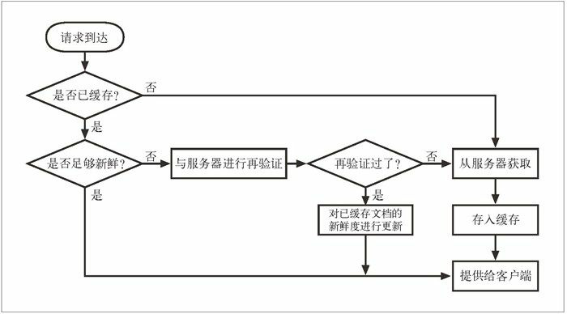

本文摘自书籍[《HTTP 权威指南》](https://www.amazon.cn/dp/B008XFDQ14/ref=sr_1_1?s=books&ie=UTF8&qid=1527513120&sr=1-1&keywords=http%E6%9D%83%E5%A8%81%E6%8C%87%E5%8D%97) 

## 缓存

Web 缓存是可以自动保存常见文档副本的 HTTP 设备。当 Web 请求抵达缓存时，如果本地有“已缓存的”副本，就可以从本地存储设备而不是原始服务器中提取这个文档。使用缓存有下列优点。

- 缓存减少了冗余的数据传输，节省了你的网络费用。
- 缓存缓解了网络瓶颈的问题。不需要更多的带宽就能够更快地加载页面。
- 缓存降低了对原始服务器的要求。服务器可以更快地响应，避免过载的出现。
- 缓存降低了距离时延，因为从较远的地方加载页面会更慢一些。

### 冗余的数据传输

有很多客户端访问一个流行的原始服务器页面时，服务器会多次传输同一份文档，每次传送给一个客户端。一些相同的字节会在网络中一遍遍地传输。这些冗余的数据传输会耗尽昂贵的网络带宽，降低传输速度，加重 Web 服务器的负载。有了缓存，就可以保留第一条服务器响应的副本，后继请求就可以由缓存的副本来应对了，这样可以减少那些流入 / 流出原始服务器的、被浪费掉了的重复流量。

### 带宽瓶颈

缓存还可以缓解网络的瓶颈问题。很多网络为本地网络客户端提供的带宽比为远程服务器提供的带宽要宽。客户端会以路径上最慢的网速访问服务器。如果客户端从一个快速局域网的缓存中得到了一份副本，那么缓存就可以提高性能——尤其是要传输比较大的文件时。

### 瞬间拥塞

缓存在破坏瞬间拥塞（Flash Crowds）时显得非常重要。突发事件（比如爆炸性新闻、批量 E-mail 公告，或者某个名人事件）使很多人几乎同时去访问一个 Web 文档时，就会出现瞬间拥塞。由此造成的过多流量峰值可能会使网络和 Web 服务器产生灾难性的崩溃。

### 距离时延

即使带宽不是问题，距离也可能成为问题。每台网络路由器都会增加因特网流量的时延。即使客户端和服务器之间没有太多的路由器，光速自身也会造成显著的时延。

### 命中和未命中

可以用已有的副本为某些到达缓存的请求提供服务。这被称为缓存命中（cache hit）。其他一些到达缓存的请求可能会由于没有副本可用，而被转发 给原始服务器。这被称为缓存未命中（cache miss）。

### 再验证

原始服务器的内容可能会发生变化，缓存要不时对其进行检测，看看它们保存的副本是否仍是服务器上最新的副本。这些“新鲜度检测”被称为 HTTP 再验证（revalidation）。为了有效地进行再验证，HTTP 定义了一些特殊的请求，不用从服务器上获取整个对象，就可以快速检测出内容是否是最新的。缓存可以在任意时刻，以任意的频率对副本进行再验证。但由于缓存中通常会包含数百万的文档，而且网络带宽是很珍贵的，所以大部分缓存只有在客户端发起请求，并且副本旧得足以需要检测的时候，才会对副本进行再验证。缓存对缓存的副本进行再验证时，会向原始服务器发送一个小的再验证请求。如果内容没有变化，服务器会以一个小的 304 Not Modified 进行响应。只要缓存知道副本仍然有效，就会再次将副本标识为暂时新鲜的，并将副本提供给客户端这被称作再验证命中（revalidate hit）或缓慢命中（slow hit）。这种方式确实要与原始服务器进行核对，所以会比单纯的缓存命中要慢，但它没有从服务器中获取对象数据，所以要比缓存未命中快一些。

HTTP 为我们提供了几个用来对已缓存对象进行再验证的工具，但最常用的是 If-Modified-Since 首部。将这个首部添加到 GET 请求中去，就可以告诉服务器，只有在缓存了对象的副本之后，又对其进行了修改的情况下，才发送此对象。这里列出了在 3 种情况下（服务器内容未被修改，服务器内容已被修改，或者服务器上的对象被删除了）服务器收到 GET If-Modified-Since 请求时会发生的情况：

- 再验证命中

  如果服务器对象未被修改，服务器会向客户端发送一个小的 HTTP 304 Not Modified 响应。

- 再验证未命中

  如果服务器对象与已缓存副本不同，服务器向客户端发送一条普通的、带有完整内容的 HTTP 200 OK 响应。

- 对象被删除

  如果服务器对象已经被删除了，服务器就回送一个 404 Not Found 响应，缓存也会将其副本删除。

### 命中率

由缓存提供服务的请求所占的比例被称为缓存命中率（cache hit rate，或称为缓存命中比例），有时也被称为文档命中率（document hit rate）。命中率在 0 到 1 之间，但通常是用百分数来描述的，0% 表示每次请求都未命中（要通过网络来获取文档），100% 表示每次请求都命中了（在缓存中有一份副本）。缓存的管理者希望缓存命中率接近 100%。而实际得到的命中率则与缓存的大小、缓存用户兴趣点的相似性、缓存数据的变化或个性化频率，以及如何配置缓存有关。命中率很难预测，但对现在中等规模的 Web 缓存来说，40% 的命中率是很合理的。缓存的好处是，即使是中等规模的缓存，其所包含的常见文档也足以显著地提高性能、减少流量了。缓存会努力确保将有用的内容保存在缓存中。

### 字节命中率

由于文档并不全是同一尺寸的，所以文档命中率并不能说明一切。有些大型对象被访问的次数可能较少，但由于尺寸的原因，对整个数据流量的贡献却更大。因此，有些人更愿意使用字节命中率（byte hit rate）作为度量值（尤其那些按流量字节付费的人！）。字节命中率表示的是缓存提供的字节在传输的所有字节中所占的比例。通过这种度量方式，可以得知节省流量的程度。100% 的字节命中率说明每个字节都来自缓存，没有流量流到因特网上去。文档命中率和字节命中率对缓存性能的评估都是很有用的。文档命中率说明阻止了多少通往外部网络的 Web 事务。事务有一个通常都很大的固定时间成分（比如，建立一条到服务器的 TCP 连接），提高文档命中率对降低整体延迟（时延）很有好处。字节命中率说明阻止了多少字节传向因特网。提高字节命中率对节省带宽很有利。

### 区分命中和未命中

客户端有一种方法可以判断响应是否来自缓存，就是使用 Date 首部。将响应中 Date 首部的值与当前时间进行比较，如果响应中的日期值比较早，客户端通常就可以认为这是一条缓存的响应。客户端也可以通过 Age 首部来检测缓存的响应，通过这个首部可以分辨出这条响应的使用期。

### 缓存流程

  

### 缓存控制

服务器可以通过 HTTP 定义的几种方式来指定在文档过期之前可以将其缓存多长时间。按照优先级递减的顺序，服务器可以：

- 附加一个 Cache-Control: no-store 首部到响应中去
- 附加一个 Cache-Control: no-cache 首部到响应中去
- 附加一个 Cache-Control: must-revalidate 首部到响应中去
- 附加一个 Cache-Control: max-age 首部到响应中去
- 附加一个 Expires 日期首部到响应中去
- 不附加过期信息，让缓存确定自己的过期日期

#### no-Store 与 no-Cache 响应首部

HTTP/1.1 提供了几种限制对象缓存，或限制提供已缓存对象的方式，以维持对象的新鲜度。no-store 首部和 no-cache 首部可以防止缓存提供未经证实的已缓存对象：

```http
Pragma: no-cache
Cache-Control: no-store
Cache-Control: no-cache
```

标识为 no-store 的响应会禁止缓存对响应进行复制。缓存通常会像非缓存代理服务器一样，向客户端转发一条 no-store 响应，然后删除对象。

标识为 no-cache 的响应实际上是可以存储在本地缓存区中的。只是在与原始服务器进行新鲜度再验证之前，缓存不能将其提供给客户端使用。

HTTP/1.1 中提供 Pragma: no-cache 首部是为了兼容于 HTTP/1.0+。除了与只理解 Pragma: no-cache 的 HTTP/1.0 应用程序进行交互时，HTTP 1.1 应用程序都应该使用 Cache-Control: no-cache。

#### max-age 响应首部

Cache-Control: max-age 首部表示的是从服务器将文档传来之时起，可以认为此文档处于新鲜状态的秒数。还有一个 s-maxage 首部（注意 maxage 的中间没有连字符），其行为与 max-age 类似，但仅适用于共享（公有）缓存：

```http
Cache-Control: max-age=3600
Cache-Control: s-maxage=3600
```

服务器可以请求缓存不要缓存文档，或者将最大使用期设置为零，从而在每次访问的时候都进行刷新：

```http
Cache-Control: max-age=0
Cache-Control: s-maxage=0
```

#### must-revalidate 响应首部

可以配置缓存，使其提供一些陈旧（过期）的对象，以提高性能。如果原始服务器希望缓存严格遵守过期信息，可以在原始响应中附加一个 Cache-Control: must-revalidate 首部。

```http
Cache-Control: must-revalidate
```

Cache-Control: must-revalidate 响应首部告诉缓存，在事先没有跟原始服务器进行再验证的情况下，不能提供这个对象的陈旧副本。缓存仍然可以随意提供新鲜的副本。如果在缓存进行 must-revalidate 新鲜度检查时，原始服务器不可用，缓存就必须返回一条 504 Gateway Timeout 错误。

#### Expires 响应首部

不推荐使用 Expires 首部，它指定的是实际的过期日期而不是秒数。HTTP 设计者后来认为，由于很多服务器的时钟都不同步，或者不正确，所以最好还是用剩余秒数，而不是绝对时间来表示过期时间。可以通过计算过期值和日期值之间的秒数差来计算类似的新鲜生存期：

```http
Expires: Fri, 05 Jul 2002, 05:00:00 GMT
```

有些服务器还会回送一个 Expires:0 响应首部，试图将文档置于永远过期的状态，但这种语法是非法的，可能给某些软件带来问题。应该试着支持这种结构的输入，但不应该产生这种结构的输出。

#### 试探性过期

如果响应中没有 Cache-Control: max-age 首部，也没有 Expires 首部，缓存可以计算出一个试探性最大使用期。可以使用任意算法，但如果得到的最大使用期大于 24 小时，就应该向响应首部添加一个 Heuristic Expiration Warning（试探性过期警告，警告 13）首部。据我们所知，很少有浏览器会为用户提供这种警告信息。

LM-Factor 算法是一种很常用的试探性过期算法，如果文档中包含了最后修改日期，就可以使用这种算法。LM-Factor 算法将最后修改日期作为依据，来估计文档有多么易变。算法的逻辑如下所示。

如果已缓存文档最后一次修改发生在很久以前，它可能会是一份稳定的文档，不太会突然发生变化，因此将其继续保存在缓存中会比较安全。

- 如果已缓存文挡最近被修改过，就说明它很可能会频繁地发生变化，因此在与服务器进行再验证之前，只应该将其缓存很短一段时间。
- 实际的 LM-Factor 算法会计算缓存与服务器对话的时间跟服务器声明文档最后被修改的时间之间的差值，取这个间隔时间的一部分，将其作为缓存中的新鲜度持续时间。

