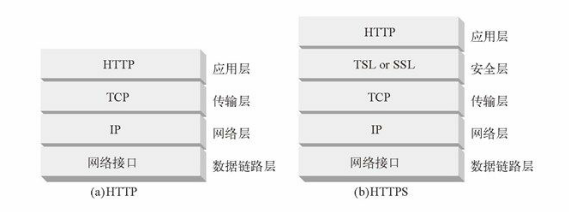
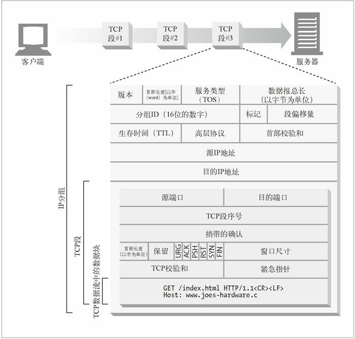
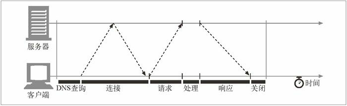
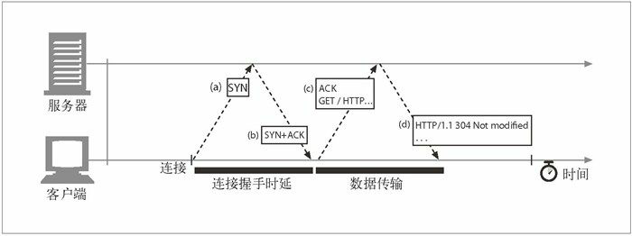
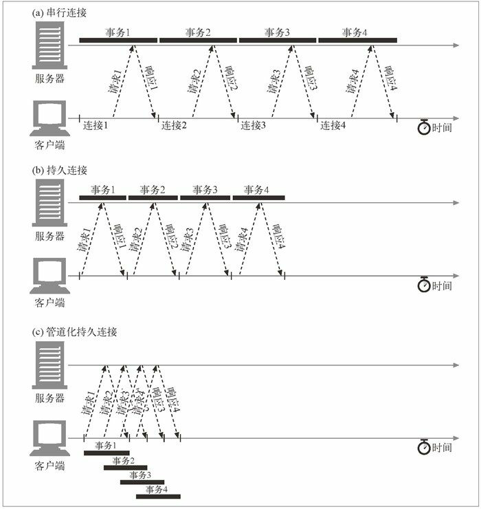

本文摘自书籍[《HTTP 权威指南》](https://www.amazon.cn/dp/B008XFDQ14/ref=sr_1_1?s=books&ie=UTF8&qid=1527513120&sr=1-1&keywords=http%E6%9D%83%E5%A8%81%E6%8C%87%E5%8D%97) 

## 连接管理

HTTP连接时HTTP报文传输的关键通道。

### TCP连接

世界上几乎所有的HTTP通信都是由TCP/IP承载的，TCP/IP是全球计算机及网络设备都在使用的一种常用的分组交换网络分层协议集。

#### TCP的可靠数据管道

HTTP实际上就是TCP连接及其使用规则，是因特网上的可靠连接。TCP为HTTP提供了一条可靠的bit传输管道。

#### TCP流是分段的、由IP分组传送

TCP 的数据是通过名为 IP 分组（或 IP 数据报）的小数据块来发送的。  

  

HTTP要传送一条报文时，会以流的形式将报文数据的内容通过一条打开的TCP连接按序传输。TCP 收到数据流之后，会将数据流砍成被称作段的小数据块，并将段封装在 IP 分组中，通过因特网进行传输。所有这些工作都是由 TCP/IP 软件来处理的，HTTP 程序员什么都看不到。

  

每个 TCP 段都是由 IP 分组承载，从一个 IP 地址发送到另一个 IP 地址的。每个 IP 分组中都包括：

- 一个 IP 分组首部（通常为 20 字节）
- 一个 TCP 段首部（通常为 20 字节）
- 一个 TCP 数据块（0 个或多个字节）

IP 首部包含了源和目的 IP 地址、长度和其他一些标记。TCP 段的首部包含了 TCP 端口号、TCP 控制标记，以及用于数据排序和完整性检查的一些数字值。

#### 保持TCP连接的持续不间断地运行

在任意时刻计算机都可以有几条 TCP 连接处于打开状态。TCP 是通过端口号来保持所有这些连接的正确运行的。IP 地址可以将你连接到正确的计算机，而端口号则可以将你连接到正确的应用程序上去。TCP 连接是通过 4 个值来识别的：

```json
<源 IP 地址、源端口号、目的 IP 地址、目的端口号>
```

这 4 个值一起唯一地定义了一条连接。两条不同的 TCP 连接不能拥有 4 个完全相同的地址组件值（但不同连接的部分组件可以拥有相同的值）。

### TCP性能考虑

HTTP 紧挨着 TCP，位于其上层，所以 HTTP 事务的性能在很大程度上取决于底层 TCP 通道的性能。

#### HTTP事务的时延

串行HTTP事务的时间线：

  

HTTP 事务的时延有以下几种主要原因：

- 客户端首先需要根据 URI 确定 Web 服务器的 IP 地址和端口号。如果最近没有对 URI 中的主机名进行访问，通过 DNS 解析系统将 URI 中的主机名转换成一个 IP 地址可能要花费数十秒的时间。
- 客户端向服务器发送一条 TCP 连接请求，并等待服务器回送一个请求接受应答。每条新的 TCP 连接都会有连接建立时延。这个值通常最多只有一两秒钟，但如果有数百个 HTTP 事务的话，这个值会快速地叠加上去。
- 一旦连接建立起来了，客户端就会通过新建立的 TCP 管道来发送 HTTP 请求。数据到达时，Web 服务器会从 TCP 连接中读取请求报文，并对请求进行处理。因特网传输请求报文，以及服务器处理请求报文都需要时间。
- Web 服务器会回送 HTTP 响应，这也需要花费时间。

这些 TCP 网络时延的大小取决于硬件速度、网络和服务器的负载，请求和响应报文的尺寸，以及客户端和服务器之间的距离。TCP 协议的技术复杂性也会对时延产生巨大的影响。

#### 性能聚焦

对 HTTP 程序员产生影响的、最常见的 TCP 相关时延，其中包括：

- TCP 连接建立握手
- TCP 慢启动拥塞控制
- 数据聚集的 Nagle 算法
- 用于捎带确认的 TCP 延迟确认算法
- TIME_WAIT 时延和端口耗尽

如果要编写高性能的 HTTP 软件，就应该理解上面的每一个因素。

#### TCP连接的握手时延

建立一条新的 TCP 连接时，甚至是在发送任意数据之前，TCP 软件之间会交换一系列的 IP 分组，对连接的有关参数进行沟通。如果连接只用来传送少量数据，这些交换过程就会严重降低 HTTP 的性能。

  

TCP 连接握手需要经过以下几个步骤:

- 请求新的 TCP 连接时，客户端要向服务器发送一个小的 TCP 分组（通常是 40 ～ 60 个字节）。这个分组中设置了一个特殊的 SYN 标记，说明这是一个连接请求。
- 如果服务器接受了连接，就会对一些连接参数进行计算，并向客户端回送一个 TCP 分组，这个分组中的 SYN 和 ACK 标记都被置位，说明连接请求已被接受.
- 最后，客户端向服务器回送一条确认信息，通知它连接已成功建立（参见图 4-8c）。现代的 TCP 栈都允许客户端在这个确认分组中发送数据。

HTTP 程序员永远不会看到这些分组——这些分组都由 TCP/IP 软件管理，对其是不可见的。HTTP 程序员看到的只是创建 TCP 连接时存在的时延。

#### 延迟确认

由于因特网自身无法确保可靠的分组传输（因特网路由器超负荷的话，可以随意丢弃分组），所以 TCP 实现了自己的确认机制来确保数据的成功传输。

每个 TCP 段都有一个序列号和数据完整性校验和。每个段的接收者收到完好的段时，都会向发送者回送小的确认分组。如果发送者没有在指定的窗口时间内收到确认信息，发送者就认为分组已被破坏或损毁，并重发数据。由于确认报文很小，所以 TCP 允许在发往相同方向的输出数据分组中对其进行“捎带”。

TCP 将返回的确认信息与输出的数据分组结合在一起，可以更有效地利用网络。为了增加确认报文找到同向传输数据分组的可能性，很多 TCP 栈都实现了一种“延迟确认”算法。延迟确认算法会在一个特定的窗口时间（通常是 100 ～ 200 毫秒）内将输出确认存放在缓冲区中，以寻找能够捎带它的输出数据分组。如果在那个时间段内没有输出数据分组，就将确认信息放在单独的分组中传送。

但是，HTTP 具有双峰特征的请求，应答行为降低了捎带信息的可能。当希望有相反方向回传分组的时候，偏偏没有那么多。通常，延迟确认算法会引入相当大的时延。根据所使用操作系统的不同，可以调整或禁止延迟确认算法。

在对 TCP 栈的任何参数进行修改之前，一定要对自己在做什么有清醒的认识。TCP 中引入这些算法的目的是防止设计欠佳的应用程序对因特网造成破坏。对 TCP 配置进行的任意修改，都要绝对确保应用程序不会引发这些算法所要避免的问题。

#### TCP慢启动

TCP 数据传输的性能还取决于 TCP 连接的使用期（age）。TCP 连接会随着时间进行自我“调谐”，起初会限制连接的最大速度，如果数据成功传输，会随着时间的推移提高传输的速度。这种调谐被称为 TCP 慢启动（slow start），用于防止因特网的突然过载和拥塞。

TCP 慢启动限制了一个 TCP 端点在任意时刻可以传输的分组数。简单来说，每成功接收一个分组，发送端就有了发送另外两个分组的权限。如果某个 HTTP 事务有大量数据要发送，是不能一次将所有分组都发送出去的。必须发送一个分组，等待确认；然后可以发送两个分组，每个分组都必须被确认，这样就可以发送四个分组了，以此类推。这种方式被称为“打开拥塞窗口”。

由于存在这种拥塞控制特性，所以新连接的传输速度会比已经交换过一定量数据的、“已调谐”连接慢一些。由于已调谐连接要更快一些，所以 HTTP 中有一些可以重用现存连接的工具。

#### Nagle算法与TCP_NODELAY

TCP 有一个数据流接口，应用程序可以通过它将任意尺寸的数据放入 TCP 栈中——即使一次只放一个字节也可以！但是，每个 TCP 段中都至少装载了 40 个字节的标记和首部，所以如果 TCP 发送了大量包含少量数据的分组，网络的性能就会严重下降。

Nagle 算法（根据其发明者 John Nagle 命名）试图在发送一个分组之前，将大量 TCP 数据绑定在一起，以提高网络效率。Nagle 算法鼓励发送全尺寸（LAN 上最大尺寸的分组大约是 1500 字节，在因特网上是几百字节）的段。只有当所有其他分组都被确认之后，Nagle 算法才允许发送非全尺寸的分组。如果其他分组仍然在传输过程中，就将那部分数据缓存起来。只有当挂起分组被确认，或者缓存中积累了足够发送一个全尺寸分组的数据时，才会将缓存的数据发送出去。

Nagle 算法会引发几种 HTTP 性能问题。首先，小的 HTTP 报文可能无法填满一个分组，可能会因为等待那些永远不会到来的额外数据而产生时延。其次，Nagle 算法与延迟确认之间的交互存在问题——Nagle 算法会阻止数据的发送，直到有确认分组抵达为止，但确认分组自身会被延迟确认算法延迟 100 ～ 200 毫秒。

HTTP 应用程序常常会在自己的栈中设置参数 TCP_NODELAY，禁用 Nagle 算法，提高性能。如果要这么做的话，一定要确保会向 TCP 写入大块的数据，这样就不会产生一堆小分组了。

#### TIME_WAIT累积与端口耗尽

TIME_WAIT 端口耗尽是很严重的性能问题，会影响到性能基准，但在现实中相对较少出现。大多数遇到性能基准问题的人最终都会碰到这个问题，而且性能都会变得出乎意料地差，所以这个问题值得特别关注。

当某个 TCP 端点关闭 TCP 连接时，会在内存中维护一个小的控制块，用来记录最近所关闭连接的 IP 地址和端口号。这类信息只会维持一小段时间，通常是所估计的最大分段使用期的两倍（称为 2MSL，通常为 2 分钟 ）左右，以确保在这段时间内不会创建具有相同地址和端口号的新连接。实际上，这个算法可以防止在两分钟内创建、关闭并重新创建两个具有相同 IP 地址和端口号的连接。

现在高速路由器的使用，使得重复分组几乎不可能在连接关闭的几分钟之后，出现在服务器上。有些操作系统会将 2MSL 设置为一个较小的值，但修改此值时要特别小心。分组确实会被复制，如果来自之前连接的复制分组插入了具有相同连接值的新 TCP 流，会破坏 TCP 数据。

2MSL 的连接关闭延迟通常不是什么问题，但在性能基准环境下就可能会成为一个问题。进行性能基准测试时，通常只有一台或几台用来产生流量的计算机连接到某系统中去，这样就限制了连接到服务器的客户端 IP 地址数。而且，服务器通常会在 HTTP 的默认 TCP 端口 80 上进行监听。用 TIME_WAIT 防止端口号重用时，这些情况也限制了可用的连接值组合。
在只有一个客户端和一台 Web 服务器的异常情况下，构建一条 TCP 连接的 4 个值：

```xml
<source-IP-address, source-port, destination-IP-address, destination-port>
```

其中的 3 个都是固定的——只有源端口号可以随意改变：

```xml
<client-IP, source-port, server-IP, 80>
```

客户端每次连接到服务器上去时，都会获得一个新的源端口，以实现连接的唯一性。但由于可用源端口的数量有限（比如，60 000 个），而且在 2MSL 秒（比如，120 秒）内连接是无法重用的，连接率就被限制在了 60 000/120=500 次 / 秒。如果再不断进行优化，并且服务器的连接率不高于 500 次 / 秒，就可确保不会遇到 TIME_WAIT 端口耗尽问题。要修正这个问题，可以增加客户端负载生成机器的数量，或者确保客户端和服务器在循环使用几个虚拟 IP 地址以增加更多的连接组合。

即使没有遇到端口耗尽问题，也要特别小心有大量连接处于打开状态的情况，或为处于等待状态的连接分配了大量控制块的情况。在有大量打开连接或控制块的情况下，有些操作系统的速度会严重减缓。

### HTTP 连接的处理

#### 常被误解的Connection首部

HTTP 允许在客户端和最终的源端服务器之间存在一串 HTTP 中间实体（代理、高速缓存等）。可以从客户端开始，逐跳地将 HTTP 报文经过这些中间设备，转发到源端服务器上去（或者进行反向传输）。在某些情况下，两个相邻的 HTTP 应用程序会为它们共享的连接应用一组选项。HTTP 的 Connection 首部字段中有一个由逗号分隔的连接标签列表，这些标签为此连接指定了一些不会传播到其他连接中去的选项。比如，可以用 Connection:close 来说明发送完下一条报文之后必须关闭的连接。Connection 首部可以承载 3 种不同类型的标签，因此有时会很令人费解：

- HTTP 首部字段名，列出了只与此连接有关的首部
- 任意标签值，用于描述此连接的非标准选项
- 值 close，说明操作完成之后需关闭这条持久连接

如果连接标签中包含了一个 HTTP 首部字段的名称，那么这个首部字段就包含了与一些连接有关的信息，不能将其转发出去。在将报文转发出去之前，必须删除 Connection 首部列出的所有首部字段。由于 Connection 首部可以防止无意中对本地首部的转发，因此将逐跳首部名放入 Connection 首部被称为“对首部的保护”。

HTTP 应用程序收到一条带有 Connection 首部的报文时，接收端会解析发送端请求的所有选项，并将其应用。然后会在将此报文转发给下一跳地址之前，删除 Connection 首部以及 Connection 中列出的所有首部。而且，可能还会有少量没有作为 Connection 首部值列出，但一定不能被代理转发的逐跳首部。其中包括 Prxoy-Authenticate、Proxy-Connection、Transfer-Encoding 和 Upgrade。

#### 串行事务处理时延

如果只对连接进行简单的管理，TCP 的性能时延可能会叠加起来。比如，假设有一个包含了 3 个嵌入图片的 Web 页面。浏览器需要发起 4 个 HTTP 事务来显示此页面： 1 个用于顶层的 HTML 页面，3 个用于嵌入的图片。如果每个事务都需要（串行地建立）一条新的连接，那么连接时延和慢启动时延就会叠加起来。

串行加载的另一个缺点是，有些浏览器在对象加载完毕之前无法获知对象的尺寸，而且它们可能需要尺寸信息来决定将对象放在屏幕的什么位置上，所以在加载了足够多的对象之前，无法在屏幕上显示任何内容。在这种情况下，可能浏览器串行装载对象的进度很正常，但用户面对的却是一个空白的屏幕，对装载的进度一无所知。

### 并行连接

浏览器可以先完整地请求原始的 HTML 页面，然后请求第一个嵌入对象，然后请求第二个嵌入对象等，以这种简单的方式对每个嵌入式对象进行串行处理。HTTP 允许客户端打开多条连接，并行地执行多个 HTTP 事务。

#### 并行连接可能会提高页面的加载速度

包含嵌入对象的组合页面如果能（通过并行连接）克服单条连接的空载时间和带宽限制，加载速度也会有所提高。时延可以重叠起来，而且如果单条连接没有充分利用客户端的因特网带宽，可以将未用带宽分配来装载其他对象。

#### 并行连接不一定更快

即使并行连接的速度可能会更快，但并不一定总是更快。客户端的网络带宽不足（比如，浏览器是通过一个 28.8kbps 的 Modem 连接到因特网上去的）时，大部分的时间可能都是用来传送数据的。在这种情况下，一个连接到速度较快服务器上的 HTTP 事务就会很容易地耗尽所有可用的 Modem 带宽。如果并行加载多个对象，每个对象都会去竞争这有限的带宽，每个对象都会以较慢的速度按比例加载，这样带来的性能提升就很小，甚至没什么提升。而且，打开大量连接会消耗很多内存资源，从而引发自身的性能问题。复杂的 Web 页面可能会有数十或数百个内嵌对象。客户端可能可以打开数百个连接，但 Web 服务器通常要同时处理很多其他用户的请求，所以很少有 Web 服务器希望出现这样的情况。一百个用户同时发出申请，每个用户打开 100 个连接，服务器就要负责处理 10 000 个连接。这会造成服务器性能的严重下降。对高负荷的代理来说也同样如此。实际上，浏览器确实使用了并行连接，但它们会将并行连接的总数限制为一个较小的值（通常是 4 个）。服务器可以随意关闭来自特定客户端的超量连接。

#### 并行连接可能让人“感觉”更快一些

即使实际上它们并没有加快页面的传输速度，并行连接通常也会让用户觉得页面加载得更快了，因为多个组件对象同时出现在屏幕上时，用户能够看到加载的进展。如果整个屏幕上有很多动作在进行，即使实际上秒表显示整个页面的下载时间更长，人们也会认为 Web 页面加载得更快一些。

### 持久连接

Web 客户端经常会打开到同一个站点的连接。比如，一个 Web 页面上的大部分内嵌图片通常都来自同一个 Web 站点，而且相当一部分指向其他对象的超链通常都指向同一个站点。因此，初始化了对某服务器 HTTP 请求的应用程序很可能会在不久的将来对那台服务器发起更多的请求（比如，获取在线图片）。这种性质被称为站点局部性（site locality）。因此，HTTP/1.1（以及 HTTP/1.0 的各种增强版本）允许 HTTP 设备在事务处理结束之后将 TCP 连接保持在打开状态，以便为未来的 HTTP 请求重用现存的连接。在事务处理结束之后仍然保持在打开状态的 TCP 连接被称为持久连接。非持久连接会在每个事务结束之后关闭。持久连接会在不同事务之间保持打开状态，直到客户端或服务器决定将其关闭为止。重用已对目标服务器打开的空闲持久连接，就可以避开缓慢的连接建立阶段。而且，已经打开的连接还可以避免慢启动的拥塞适应阶段，以便更快速地进行数据的传输。

#### 持久以及并行连接

并行连接的缺点：

- 每个事务都会打开 / 关闭一条新的连接，会耗费时间和带宽
- 由于 TCP 慢启动特性的存在，每条新连接的性能都会有所降低
- 可打开的并行连接数量实际上是有限的

持久连接有一些比并行连接更好的地方。持久连接降低了时延和连接建立的开销，将连接保持在已调谐状态，而且减少了打开连接的潜在数量。但是，管理持久连接时要特别小心，不然就会累积出大量的空闲连接，耗费本地以及远程客户端和服务器上的资源。持久连接与并行连接配合使用可能是最高效的方式。现在，很多 Web 应用程序都会打开少量的并行连接，其中的每一个都是持久连接。持久连接有两种类型：比较老的 HTTP/1.0+“keep-alive”连接，以及现代的 HTTP/1.1“persistent”连接。

#### Keep-Alive 操作

keep-alive 已经不再使用了，而且在当前的 HTTP/1.1 规范中也没有对它的说明了。但浏览器和服务器对 keep-alive 握手的使用仍然相当广泛，因此，HTTP 的实现者应该做好与之进行交互操作的准备。

实现 HTTP/1.0 keep-alive 连接的客户端可以通过包含 Connection: Keep-Alive 首部请求将一条连接保持在打开状态。如果服务器愿意为下一条请求将连接保持在打开状态，就在响应中包含相同的首部。如果响应中没有 Connection: Keep-Alive 首部，客户端就认为服务器不支持 keep-alive，会在发回响应报文之后关闭连接。

#### Keep-Alive 选项

注意，keep-Alive 首部只是请求将连接保持在活跃状态。发出 keep-alive 请求之后，客户端和服务器并不一定会同意进行 keep-alive 会话。它们可以在任意时刻关闭空闲的 keep-alive 连接，并可随意限制 keep-alive 连接所处理事务的数量。

可以用 Keep-Alive 通用首部中指定的、由逗号分隔的选项来调节 keep-alive 的行为：

- 参数 timeout 是在 Keep-Alive 响应首部发送的。它估计了服务器希望将连接保持在活跃状态的时间。这并不是一个承诺值。
- 参数 max 是在 Keep-Alive 响应首部发送的。它估计了服务器还希望为多少个事务保持此连接的活跃状态。这并不是一个承诺值。
- Keep-Alive 首部还可支持任意未经处理的属性，这些属性主要用于诊断和调试。语法为 name [=value]。

Keep-Alive 首部完全是可选的，但只有在提供 Connection: Keep-Alive 时才能使用它。

#### Keep-Alive 连接的限制和规则

- 在 HTTP/1.0 中，keep-alive 并不是默认使用的。客户端必须发送一个 Connection: Keep-Alive 请求首部来激活 keep-alive 连接。
- Connection: Keep-Alive 首部必须随所有希望保持持久连接的报文一起发送。如果客户端没有发送Connection: Keep-Alive 首部，服务器就会在那条请求之后关闭连接。
- 通过检测响应中是否包含Connection: Keep-Alive响应首部，客户端可以判断服务器是否会在发出响应之后关闭连接。
- 只有在可确定报文实体主体部分长度的情况下，才能将连接保持在打开状态——也就是说实体的主体部分必须有正确的 Content-Length，有多部件媒体类型，或者用分块传输编码的方式进行了编码。在一条 keep-alive 信道中回送错误的 Content-Length 是很糟糕的事，这样的话，事务处理的另一端就无法精确地检测出一条报文的结束和另一条报文的开始了。
- 代理和网关必须执行 Connection 首部的规则。代理或网关必须在将报文转发出去或将其高速缓存之前，删除在 Connection 首部中命名的所有首部字段以及 Connection 首部自身。
- 严格来说，不应该与无法确定是否支持 Connection 首部的代理服务器建立 keep-alive 连接，以防止出现下面要介绍的哑代理问题。
- 从技术上来讲，应该忽略所有来自 HTTP/1.0 设备的 Connection 首部字段（包括 Connection: Keep-Alive），因为它们可能是由比较老的代理服务器误转发的。但实际上，尽管可能会有在老代理上挂起的危险，有些客户端和服务器还是会违反这条规则。
- 除非重复发送请求会产生其他一些副作用，否则如果在客户端收到完整的响应之前连接就关闭了，客户端就一定要做好重试请求的准备。

#### Keep-Alive 和哑代理

1) **Connection 首部和盲中继**

问题出在代理上——尤其是那些不理解 Connection 首部，而且不知道在沿着转发链路将其发送出去之前，应该将该首部删除的代理。很多老的或简单的代理都是盲中继（blind relay），它们只是将字节从一个连接转发到另一个连接中去，不对 Connection 首部进行特殊的处理。

- Web 客户端向代理发送了一条报文，其中包含了 Connection: Keep-Alive 首部，如果可能的话请求建立一条 keep-alive 连接。客户端等待响应，以确定对方是否认可它对 keep-alive 信道的请求。
- 哑代理收到了这条 HTTP 请求，但它并不理解 Connection 首部（只是将其作为一个扩展首部对待）。代理不知道 keep-alive 是什么意思，因此只是沿着转发链路将报文一字不漏地发送给服务器。但 Connection 首部是个逐跳首部，只适用于单条传输链路，不应该沿着传输链路向下传输。
- 经过中继的 HTTP 请求抵达了 Web 服务器。当 Web 服务器收到经过代理转发的 Connection: Keep-Alive 首部时，会误以为代理（对服务器来说，这个代理看起来就和所有其他客户端一样）希望进行 keep-alive 对话！对 Web 服务器来说这没什么问题——它同意进行 keep-alive 对话，并回送了一个 Connection: Keep-Alive 响应首部。所以，此时 Web 服务器认为它在与代理进行 keep-alive 对话，会遵循 keep-alive 的规则。但代理却对 keep-alive 一无所知。
- 哑代理将 Web 服务器的响应报文回送给客户端，并将来自 Web 服务器的Connection: Keep-Alive 首部一起传送过去。客户端看到这个首部，就会认为代理同意进行 keep-alive 对话。所以，此时客户端和服务器都认为它们在进行 keep-alive 对话，但与它们进行对话的代理却对 keep-alive 一无所知。
- 由于代理对 keep-alive 一无所知，所以会将收到的所有数据都回送给客户端，然后等待源端服务器关闭连接。但源端服务器会认为代理已经显式地请求它将连接保持在打开状态了，所以不会去关闭连接。这样，代理就会挂在那里等待连接的关闭。
- 客户端在收到了回送的响应报文时，会立即转向下一条请求，在 keep-alive 连接上向代理发送另一条请求。而代理并不认为同一条连接上会有其他请求到来，请求被忽略，浏览器就在这里转圈，不会有任何进展了。
- 这种错误的通信方式会使浏览器一直处于挂起状态，直到客户端或服务器将连接超时，并将其关闭为止。

2) **代理和逐跳首部**

为避免此类代理通信问题的发生，现代的代理都绝不能转发 Connection 首部和所有名字出现在 Connection 值中的首部。因此，如果一个代理收到了一个 Connection: Keep-Alive 首部，是不应该转发 Connection 首部，或所有名为 Keep-Alive 的首部的。另外，还有几个不能作为 Connection 首部值列出，也不能被代理转发或作为缓存响应使用的首部。其中包括 Proxy-Authenticate、Proxy-Connection、Transfer-Encoding 和 Upgrade。

#### HTTP/1.1持久连接

HTTP/1.1 逐渐停止了对 keep-alive 连接的支持，用一种名为持久连接（persistent connection）的改进型设计取代了它。持久连接的目的与 keep-alive 连接的目的相同，但工作机制更优一些。与 HTTP/1.0+ 的 keep-alive 连接不同，HTTP/1.1 持久连接在默认情况下是激活的。除非特别指明，否则HTTP/1.1 假定所有连接都是持久的。要在事务处理结束之后将连接关闭，HTTP/1.1 应用程序必须向报文中显式地添加一个 Connection: close 首部。HTTP/1.1 客户端假定在收到响应后，除非响应中包含了 Connection: close 首部，不然 HTTP/1.1 连接就仍维持在打开状态。但是，客户端和服务器仍然可以随时关闭空闲的连接。不发送 Connection: close 并不意味着服务器承诺永远将连接保持在打开状态。

#### 持久连接的限制和规则

- 发送了 Connection: close 请求首部之后，客户端就无法在那条连接上发送更多的请求了。
- 如果客户端不想在连接上发送其他请求了，就应该在最后一条请求中发送一个 Connection: close 请求首部。
- 只有当连接上所有的报文都有正确的、自定义报文长度时——也就是说，实体主体部分的长度都和相应的 Content-Length 一致，或者是用分块传输编码方式编码的——连接才能持久保持。
- HTTP/1.1 的代理必须能够分别管理与客户端和服务器的持久连接——每个持久连接都只适用于一跳传输。
- HTTP/1.1 的代理服务器不应该与 HTTP/1.0 客户端建立持久连接，除非它们了解客户端的处理能力。实际上，这一点是很难做到的，很多厂商都违背了这一原则。
- 尽管服务器不应该试图在传输报文的过程中关闭连接，而且在关闭连接之前至少应该响应一条请求，但不管 Connection 首部取了什么值，HTTP/1.1 设备都可以在任意时刻关闭连接。
- HTTP/1.1 应用程序必须能够从异步的关闭中恢复出来。只要不存在可能会累积起来的副作用，客户端都应该重试这条请求。
- 除非重复发起请求会产生副作用，否则如果在客户端收到整条响应之前连接关闭了，客户端就必须要重新发起请求。
- 一个用户客户端对任何服务器或代理最多只能维护两条持久连接，以防服务器过载。代理可能需要更多到服务器的连接来支持并发用户的通信，所以，如果有 N 个用户试图访问服务器的话，代理最多要维持 2_N_ 条到任意服务器或父代理的连接。

### 管道化连接

HTTP/1.1 允许在持久连接上可选地使用请求管道。这是相对于 keep-alive 连接的又一性能优化。在响应到达之前，可以将多条请求放入队列。当第一条请求通过网络流向地球另一端的服务器时，第二条和第三条请求也可以开始发送了。在高时延网络条件下，这样做可以降低网络的环回时间，提高性能。

  

对管道化连接有几条限制：

- 如果 HTTP 客户端无法确认连接是持久的，就不应该使用管道。
- 必须按照与请求相同的顺序回送 HTTP 响应。HTTP 报文中没有序列号标签，因此如果收到的响应失序了，就没办法将其与请求匹配起来了。
- HTTP 客户端必须做好连接会在任意时刻关闭的准备，还要准备好重发所有未完成的管道化请求。如果客户端打开了一条持久连接，并立即发出了 10 条请求，服务器可能在只处理了5 条请求之后关闭连接。剩下的 5 条请求会失败，客户端必须能够应对这些过早关闭连接的情况，重新发出这些请求。
- HTTP 客户端不应该用管道化的方式发送会产生副作用的请求（比如 POST）。总之，出错的时候，管道化方式会阻碍客户端了解服务器执行的是一系列管道化请求中的哪一些。由于无法安全地重试 POST 这样的非幂等请求，所以出错时，就存在某些方法永远不会被执行的风险。

### 关闭连接的奥秘

#### “任意”解除连接

所有 HTTP 客户端、服务器或代理都可以在任意时刻关闭一条 TCP 传输连接。通常会在一条报文结束时关闭连接，1 但出错的时候，也可能在首部行的中间，或其他奇怪的地方关闭连接。对管道化持久连接来说，这种情形是很常见的。HTTP 应用程序可以在经过任意一段时间之后，关闭持久连接。比如，在持久连接空闲一段时间之后，服务器可能会决定将其关闭。但是，服务器永远都无法确定在它关闭“空闲”连接的那一刻，在线路那一头的客户端有没有数据要发送。如果出现这种情况，客户端就会在写入半截请求报文时发现出现了连接错误。

#### Content-Length 及截尾操作

每条 HTTP 响应都应该有精确的 Content-Length 首部，用以描述响应主体的尺寸。一些老的 HTTP 服务器会省略 Content-Length 首部，或者包含错误的长度指示，这样就要依赖服务器发出的连接关闭来说明数据的真实末尾。客户端或代理收到一条随连接关闭而结束的 HTTP 响应，且实际传输的实体长度与 Content-Length 并不匹配（或没有 Content-Length）时，接收端就应该质疑长度的正确性。如果接收端是个缓存代理，接收端就不应该缓存这条响应（以降低今后将潜在的错误报文混合起来的可能）。代理应该将有问题的报文原封不动地转发出去，而不应该试图去“校正”Content-Length，以维护语义的透明性。

#### 连接关闭容限、重试以及幂等性

即使在非错误情况下，连接也可以在任意时刻关闭。HTTP 应用程序要做好正确处理非预期关闭的准备。如果在客户端执行事务的过程中，传输连接关闭了，那么，除非事务处理会带来一些副作用，否则客户端就应该重新打开连接，并重试一次。对管道化连接来说，这种情况更加严重一些。客户端可以将大量请求放入队列中排队，但源端服务器可以关闭连接，这样就会留下大量未处理的请求，需要重新调度。

副作用是很重要的问题。如果在发送出一些请求数据之后，收到返回结果之前，连接关闭了，客户端就无法百分之百地确定服务器端实际激活了多少事务。有些事务，比如 GET 一个静态的 HTML 页面，可以反复执行多次，也不会有什么变化。而其他一些事务，比如向一个在线书店 POST 一张订单，就不能重复执行，不然会有下多张订单的危险。如果一个事务，不管是执行一次还是很多次，得到的结果都相同，这个事务就是幂等的。实现者们可以认为 GET、HEAD、PUT、DELETE、TRACE 和 OPTIONS 方法都共享这一特性。2 客户端不应该以管道化方式传送非幂等请求（比如 POST）。否则，传输连接的过早终止就会造成一些不确定的后果。要发送一条非幂等请求，就需要等待来自前一条请求的响应状态。

#### 正常关闭连接

TCP 连接是双向的。TCP 连接的每一端都有一个输入队列和一个输出队列，用于数据的读或写。放入一端输出队列中的数据最终会出现在另一端的输入队列中。

1）**完全关闭与半关闭**

应用程序可以关闭 TCP 输入和输出信道中的任意一个，或者将两者都关闭了。套接字调用 close() 会将 TCP 连接的输入和输出信道都关闭了。这被称作“完全关闭”；还可以用套接字调用 shutdown() 单独关闭输入或输出信道。这被称为“半关闭”。

2）**TCP关闭及重置错误**

简单的 HTTP 应用程序可以只使用完全关闭。但当应用程序开始与很多其他类型的 HTTP 客户端、服务器和代理进行对话且开始使用管道化持久连接时，使用半关闭来防止对等实体收到非预期的写入错误就变得很重要了。

总之，关闭连接的输出信道总是很安全的。连接另一端的对等实体会在从其缓冲区中读出所有数据之后收到一条通知，说明流结束了，这样它就知道你将连接关闭了。

关闭连接的输入信道比较危险，除非你知道另一端不打算再发送其他数据了。如果另一端向你已关闭的输入信道发送数据，操作系统就会向另一端的机器回送一条 TCP“连接被对端重置”的报文。大部分操作系统都会将这种情况作为很严重的错误来处理，删除对端还未读取的所有缓存数据。对管道化连接来说，这是非常糟糕的事情。

比如你已经在一条持久连接上发送了 10 条管道式请求了，响应也已经收到了，正在操作系统的缓冲区中存着呢（但应用程序还未将其读走）。现在，假设你发送了第 11 条请求，但服务器认为你使用这条连接的时间已经够长了，决定将其关闭。那么你的第 11 条请求就会被发送到一条已关闭的连接上去，并会向你回送一条重置信息。这个重置信息会清空你的输入缓冲区。当你最终要去读取数据的时候，会得到一个连接被对端重置的错误，已缓存的未读响应数据都丢失了，尽管其中的大部分都已经成功抵达你的机器了。

#### 正常关闭

HTTP 规范建议，当客户端或服务器突然要关闭一条连接时，应该“正常地关闭传输连接”，但它并没有说明应该如何去做。总之，实现正常关闭的应用程序首先应该关闭它们的输出信道，然后等待连接另一端的对等实体关闭它的输出信道。当两端都告诉对方它们不会再发送任何数据（比如关闭输出信道）之后，连接就会被完全关闭，而不会有重置的危险。但不幸的是，无法确保对等实体会实现半关闭，或对其进行检查。因此，想要正常关闭连接的应用程序应该先半关闭其输出信道，然后周期性地检查其输入信道的状态（查找数据，或流的末尾）。如果在一定的时间区间内对端没有关闭输入信道，应用程序可以强制关闭连接，以节省资源。