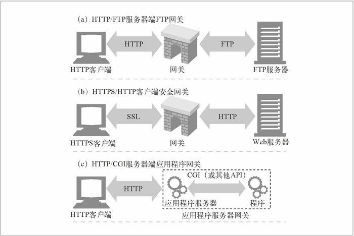
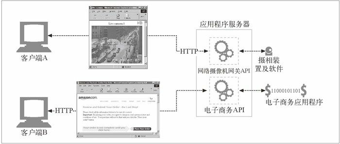

本文摘自书籍[《HTTP 权威指南》](https://www.amazon.cn/dp/B008XFDQ14/ref=sr_1_1?s=books&ie=UTF8&qid=1527513120&sr=1-1&keywords=http%E6%9D%83%E5%A8%81%E6%8C%87%E5%8D%97) 

## 网关

HTTP 扩展和接口的发展是由用户需求驱动的。要在 Web 上发布更复杂资源的需求出现时，人们很快就明确了一点：单个应用程序无法处理所有这些能想到的资源。为了解决这个问题，开发者提出了网关（gateway）的概念，网关可以作为某种翻译器使用，它抽象出了一种能够到达资源的方法。网关是资源和应用程序之间的粘合剂。应用程序可以（通过 HTTP 或其他已定义的接口）请求网关来处理某条请求，网关可以提供一条响应。网关可以向数据库发送查询语句，或者生成动态的内容，就像一个门一样：进去一条请求，出来一个响应。

  

- a 中，网关收到了对 FTP URL 的 HTTP 请求。然后网关打开 FTP 连接，并向 FTP 服务器发布适当的命令。然后将文档和正确的 HTTP 首部通过 HTTP 回送。
- b 中，网关通过 SSL 收到了一条加密的 Web 请求，网关会对请求进行解密，1 然后向目标服务器转发一条普通的 HTTP 请求。可以将这些安全加速器直 接放在（通常处于同一场所的）Web 服务器前面，以便为原始服务器提供高性能 的加密机制。
- c 中，网关通过应用程序服务器网关 API，将 HTTP 客户端连接到服务器端的应用程序上去。在网上的电子商店购物、查看天气预报，或者获取股票报价时，访问的就是应用程序服务器网关。

### 协议网关

#### HTTP/*：服务器端Web网关

请求流入原始服务器时，服务器端 Web 网关会将客户端 HTTP 请求转换为其他协议。

#### HTTP/HTTPS：服务器端安全网关

一个组织可以通过网关对所有的输入 Web 请求加密，以提供额外的隐私和安全性保护。客户端可以用普通的 HTTP 浏览 Web 内容，但网关会自动加密用户的对话。

#### HTTPS/HTTP客户端安全加速器网关

将 HTTPS/HTTP 网关作为安全加速器使用的情况是越来越多了。这些 HTTPS/HTTP 网关位于 Web 服务器之前，通常作为不可见的拦截网关或反向代理使用。它们接收安全的 HTTPS 流量，对安全流量进行解密，并向 Web 服务器发送普通的 HTTP 请求。这些网关中通常都包含专用的解密硬件，以比原始服务器有效得多的方式来解密安全流量，以减轻原始服务器的负荷。这些网关在网关和原始服务器之间发送的是未加密的流量，所以，要谨慎使用，确保网关和原始服务器之间的网络是安全的。

### 资源网关

到目前为止，我们一直在讨论通过网络连接客户端和服务器的网关。但最常见的网关，应用程序服务器，会将目标服务器与网关结合在一个服务器中实现。应用程序服务器是服务器端网关，与客户端通过 HTTP 进行通信，并与服务器端的应用程序相连。

  

在图中，两个客户端是通过 HTTP 连接到应用程序服务器的。但应用程序服务器并没有回送文件，而是将请求通过一个网关应用编程接口（Application Programming Interface，API）发送给运行在服务器上的应用程序。

第一个流行的应用程序网关 API 就是通用网关接口（Common Gateway Interface， CGI）。CGI 是一个标准接口集，Web服务器可以用它来装载程序以响应对特定 URL 的 HTTP 请求，并收集程序的输出数据，将其放在 HTTP 响应中回送。

早期的 Web 服务器是相当简单的，在网关接口的实现过程中采用的简单方式一直持续到了今天。请求需要使用网关的资源时，服务器会请辅助应用程序来处理请求。服务器会将辅助应用程序所需的数据传送给它。通常就是整条请求，或者用户想在数据库上运行的请求（来自 URL 的请求字符串，参见第 2 章）之类的东西。然后，它会向服务器返回一条响应或响应数据，服务器则会将其转发给客户端。服务器和网关是相互独立的应用程序，因此，它们的责任是分得很清楚的。图 8-9 显 示了服务器与网关应用程序之间交互的基本运行机制。这个简单的协议（输入请求，转交，响应）就是最古老，也最常用的服务器扩展接口 CGI 的本质。

#### CGI

通用网关接口，CGI 是第一个，可能仍然是得到最广泛使用的服务器扩展。在 Web 上广泛用于动态 HTML、信用卡处理以及数据库查询等任务。CGI 应用程序是独立于服务器的，所以，几乎可以用任意语言来实现，包括 Perl、Tcl、C 和各种 shell 语言。CGI 很简单，几乎所有的 HTTP 服务器都支持它。CGI 的处理对用户来说是不可见的。从客户端的角度来看，就像发起一个普通请求一样。它完全不清楚服务器和 CGI 应用程序之间的转接过程。

它在服务器和众多的资源类型之间提供了一种简单的、函数形式的粘合方式，用来处理各种需要的转换。这个接口还能很好地保护服务器，防止一些糟糕的扩展对它造成的破坏（如果这些扩展直接与服务器相连，造成的错误可能会引发服务器崩溃）。但是，这种分离会造成性能的耗费。为每条 CGI 请求引发一个新进程的开销是很高的，会限制那些使用 CGI 的服务器的性能，并且会加重服务端机器资源的负担。为了解决这个问题，人们开发了一种新型 CGI——并将其恰当地称为快速 CGI。这个接口模拟了 CGI，但它是作为持久守护进程运行的，消除了为每个请求建立或拆除新进程所带来的性能损耗。