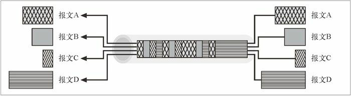

## HTTP - NG

HTTP/1.1 现在提供了可以追踪文档版本的标记和指纹，提供了一些方法来支持文档的上传以及与可编程网关之间的交互，还提供对多语言内容、安全及认证功能、降低流量的缓存功能、减小时延的管道功能、降低启动时间提高带宽使用效率的持久连接，以及用来进行部分更新的访问范围功能的支持。HTTP 的扩展及衍生产品具有更为广泛的功能，可以提供对文档发布、应用程序服务、任意的消息服务、视频流以及无线多媒体访问的支持。HTTP 正在成为分布式多媒体应用程序的“操作系统”。

尽管 HTTP/1.1 的设计经过了充分的考量，但随着 HTTP 被越来越多地用作复杂远程操作的统一载体，HTTP/1.1 已经开始显现出了一些局限性。HTTP 的发展中至少存在 4 个方面的问题:

- 复杂性

  HTTP 相当复杂，而且其特性之间是相互依存的。由于存在一些复杂的、相互交织的要求，以及连接管理、报文处理和功能逻辑之间的混合作用，要想正确地实现 HTTP 软件肯定是非常痛苦、很容易出错的。

- 可扩展性

  HTTP 很难实现递增式扩展。很多流传下来的 HTTP 应用程序中都没有自主的功能性扩展技术，使协议的扩展无法兼容。

- 性能

  HTTP 中有些部分效率不高。其中很多低效特性会随着高时延、低吞吐量的无线访问技术的广泛使用而变得更加严重。

- 传输依赖性

  HTTP 是围绕 TCP/IP 网络协议栈设计的。尽管没有限制说不能使用替代协议栈，但在这方面所做的工作非常少。HTTP 要为替代协议栈提供更多的支持，才能作为一个更广阔的报文发送平台应用于嵌入式和无线应用程序之中。

HTTP-NG 给出了 HTTP 未来一些潜在的发展方向。在 1998 年 12 月举行的一次 IETF 会议上，提出了一组 HTTP-NG 建议。这些建议勾勒出了一种可能的 HTTP 主要发展方向。这项技术还未被广泛采用（可能永远也不会被广泛采用了），但 HTTP-NG 确实在扩展 HTTP 系统方面做出了最认真的努力。

### 模块化及功能增强

可以用三个英语单词来描述 HTTP-NG 的主题：“模块化及功能增强”（modularize and enhance）。

  

HTTP-NG 工作组建议将协议模块化为三层，而不是将连接管理、报文处理、服务器处理逻辑和协议方法全都混在一起。

- 第一层，报文传输层（message transport layer）

  这一层不考虑报文的功能，而是致力于端点间报文的不透明传输。报文传输层支持各种子协议栈（比如无线环境下的协议栈），主要负责处理高效报文传输及处理方面的问题。HTTP-NG 项目组为本层提出了一个名为 WebMUX 的协议。

- 第二层，远程调用层（remote invocation layer）

  定义了请求 / 响应的功能，客户端可以通过这些功能调用对服务器资源的操作。本层独立于报文的传输以及操作的精确语义。它只是提供了一种标准的方法来调用服务器上所有的操作。本层试图提供一种像 CORBA、DCOM 和 Jave RMI 那样的面向对象的可扩展框架，而不是 HTTP/1.1 中那种静态的、服务器端定义的方法。HTTP-NG 项目组建议本层使用二进制连接协议（Binary Wire Protocol）。

- 第三层，Web 应用层（Web application layer）

  提供了大部分的内容管理逻辑。所有的 HTTP/1.1 方 法（GET、POST、PUT 等 ），以及 HTTP/1.1 首部参数都是在这里定义的。本层还支持其他构建在远程调用基础上的服务，比如 WebDAV。

### 分布式对象

HTTP-NG 的很多基本原理和功能目标都是从 CORBA 和 DCOM 这样的结构化、面向对象的分布式对象系统中借鉴来的。分布式对象系统对可扩展性和功能特性都很有帮助。将 Web 和分布式对象统一起来的雄心使得 HTTP-NG 的应用受到了某些社团的抵制。过去的一些分布式对象系统受到了重量级实现方案和形式上复杂性的影响。HTTP-NG 项目组也尝试去解决需求中提到的一些问题。

### 第一层  报文传输

报文传输层关心的是报文的有效传输，不考虑报文的含义和目的。报文传输层为报文传输提供了一个 API，无论底层实际采用的是什么网络协议栈都可以使用。
本层关注的是提高报文传输的性能，其中包括：

- 对报文进行管道化和批量化传输，以降低往返时延
- 重用连接，以降低时延，提高传输带宽
- 在同一条连接上并行地复用多个报文流，在防止报文流饿死的同时优化共享连接
- 对报文进行有效的分段，使报文边界的确定更加容易

HTTP-NG 工作组将大部分精力都放在了为第一层的报文传输开发 WebMUX 协议上。WebMUX 是个高性能的报文协议，可以对报文进行分段，并在一条复用的 TCP 连接上交错地传输报文。

### 第二层  远程调用

HTTP-NG 结构的中间层提供了对远程方法调用的支持。本层提供了通用的请求 / 响应框架，客户端可通过此框架调用对服务器资源的操作。本层并不关心特定操作的实现及语义（缓存、安全性以及方法逻辑等）；它只关心允许客户端远程调用服务器操作的接口。

现在已经有很多远程方法调用标准了（举几个例子来说，比如 CORBA、DOM 和 Java RMI），本层并不打算支持这些系统中所有好的特性。但它有一个明确的目标，就是要对 HTTP/1.1 所提供的 HTTP RMI 支持进行扩展。特别是，要以可扩展的面向对象方式提供更通用的远程过程调用支持。

HTTP-NG 小组建议本层采用二进制连接协议。这个协议支持一种高性能的可扩展技术，通过这种技术可以调用服务器上经过良好描述的操作，并将结果返回。

### 第三层  Web 应用

Web 应用层是执行语义和应用程序特定逻辑的地方。HTTP-NG 工作组避开了扩展 HTTP 应用特性的诱惑，专注于正规的基础建设工作。

Web 应用层描述了一个用于提供应用程序特定服务的系统。这些服务并不单一，不同的应用程序可能使用不同的 API。比如，HTTP/1.1 的 Web 应用构成的应用程序与 WebDAV 可能会共享一些公用的部分，但又会有所不同。HTTP-NG 结构允许多个应用共存于本层，共享底层特性，它还提供了一种添加新应用程序的机制。

Web 应用层的基本思想是提供与 HTTP/1.1 等价的功能和一些扩展接口，同时将其映射到一个可扩展的分布式对象框架中去。

### WebMUX

HTTP-NG 工作组花费了很多精力，为报文传输开发了 WebMUX 标准。WebMUX 是一个复杂的高性能报文系统，通过这个系统，可以在一个复用的 TCP 连接上并行地传输报文。可以对以不同速度产生和消耗的独立报文流进行高效的分组，并将其复用到一条或少数几条 TCP 连接上去。

  

WebMUX 协议的关键目标包括如下几条：

- 设计简单

- 高性能

- 复用

  可以在一条连接上动态、高效地交错传递多个（使用任意高层协议的）数据流，不用因为等待那些速度很慢的生产者程序而延迟数据的传输。

- 基于信用的流量控制

  数据是以不同的速率产生和消耗的，发送者和接收者的内存和可用的 CPU 资源都有所不同。WebMUX 使用的是“基于信用的”流量控制方案，接收者可以预先声明期望的数据接收速度，防止出现资源缺乏产生的死锁。

- 保持对齐

  保持复用流中数据的对齐，这样才能有效地发送并处理二进制数据。

- 丰富的功能

  接口足够丰富，能支持套接字 API。

### 二进制连接协议

HTTP-NG 小组建议使用二进制连接协议来提高下一代 HTTP 协议支持远程操作的能力。

HTTP-NG 定义了一些“对象类型”，并为每种对象类型分配了一组方法。为每种对象类型分配一个 URI，以便将对它的描述和它的方法宣传出去。通过这种方式，HTTP-NG 提供了一种比 HTTP/1.1 的扩展性更强，且面向对象的执行模型， HTTP/1.1 中所有的方法都是在服务器中静态定义的。

二进制连接协议通过一条有状态的连接承载了从客户端发往服务器的操作调用请求，以及从服务器发往客户端的操作结果应答。有状态的连接可以提供更高的效率。请求报文中包含操作、目标对象和可选的数据值。应答报文带回了操作的最终状态、所对应请求的序列号（允许以任意顺序传递并行的请求和响应），以及可选的返回值。除了请求和应答报文之外，这个协议还定义了几种内部控制报文，用来提高连接的效率和强壮性。