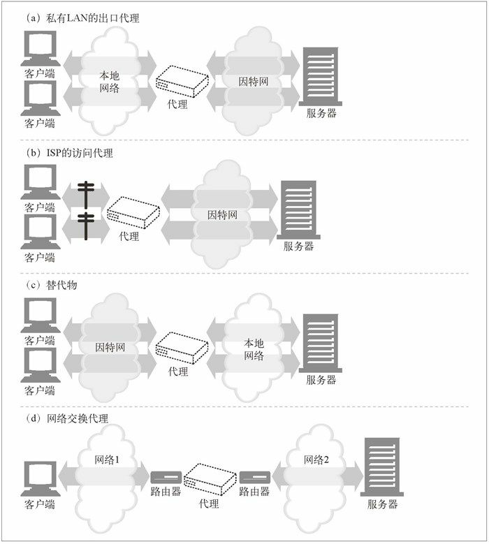

本文摘自书籍[《HTTP 权威指南》](https://www.amazon.cn/dp/B008XFDQ14/ref=sr_1_1?s=books&ie=UTF8&qid=1527513120&sr=1-1&keywords=http%E6%9D%83%E5%A8%81%E6%8C%87%E5%8D%97) 

## 代理

Web 代理（proxy）服务器是网络的中间实体。代理位于客户端和服务器之间，扮演“中间人”的角色，在各端点之间来回传送 HTTP 报文。

### web中间实体

Web 上的代理服务器是代表客户端完成事务处理的中间人。如果没有 Web 代理，HTTP 客户端就要直接与 HTTP 服务器进行对话。有了 Web 代理，客户端就可以与代理进行对话，然后由代理代表客户端与服务器进行交流。客户端仍然会完成对事务的处理，但它是通过代理服务器提供的优质服务来实现的。HTTP 的代理服务器既是 Web 服务器又是 Web 客户端。HTTP 客户端会向代理发送请求报文，代理服务器必须像 Web 服务器一样，正确地处理请求和连接，然后返回响应。同时，代理自身要向服务器发送请求，这样，其行为就必须像正确的 HTTP 客户端一样，要发送请求并接收响应。如果要创建自己的 HTTP 代理，就要认真地遵循为 HTTP 客户端和 HTTP 服务器制定的规则。

#### 私有和共享代理

单个客户端专用的代理被称为私有代理。众多客户端共享的代理被称为公共代理。

- 公共代理

  大多数代理都是公共的共享代理。集中式代理的成本效率更高，更容易管理。某些代理应用，比如高速缓存代理服务器，会利用用户间共同的请求，这样的话，汇入同一个代理服务器的用户越多，它就越有用。

- 私有代理

  专用的私有代理并不常见，但它们确实存在，尤其是直接运行在客户端计算机上的时候。有些浏览器辅助产品，以及一些 ISP 服务，会在用户的 PC 上直接运行一些小型的代理，以便扩展浏览器特性，提高性能，或为免费 ISP 服务提供主机广告。

#### 代理与网关的对比

严格来说，代理连接的是两个或多个使用相同协议的应用程序，而网关连接的则是两个或多个使用不同协议的端点。网关扮演的是“协议转换器”的角色，即使客户端和服务器使用的是不同的协议，客户端也可以通过它完成与服务器之间的事务处理。实际上，代理和网关之间的区别很模糊。由于浏览器和服务器实现的是不同版本的 HTTP，代理也经常要做一些协议转换工作。而商业化的代理服务器也会实现网关的功能来支持 SSL 安全协议、SOCKS 防火墙、FTP 访问，以及基于 Web 的应用程序。

### 为什么使用代理

代理服务器可以实现各种时髦且有用的功能。它们可以改善安全性，提高性能，节省费用。代理服务器可以看到并接触到所有流过的 HTTP 流量，所以代理可以监视流量并对其进行修改，以实现很多有用的增值 Web 服务。

- 过滤器

  可以利用过滤器代理来阻止学生访问成人内容。代理应该允许学生无限制地访问教育性内容，但对不适合儿童的站点要强行禁止访问。

- 文档访问控制

  可以用代理服务器在大量 Web 服务器和 Web 资源之间实现统一的访问控制策略，创建审核跟踪机制。这在大型企业环境或其他分布式机构中是很有用的。在集中式代理服务器上可以对所有访问控制功能进行配置，而无需在众多由不同组织管理、不同厂商制造、使用不同模式的 Web 服务器上进行经常性的访问控制升级。

- 安全防火墙

  网络安全工程师通常会使用代理服务器来提高安全性。代理服务器会在网络中的单一安全节点上限制哪些应用层协议的数据可以流入或流出一个组织。还可以提供用来消除病毒的 Web 和 E-mail 代理使用的那种挂钩程序，以便对流量进行详细的检查。

- Web 缓存

  代理缓存维护了常用文档的本地副本，并将它们按需提供，以减少缓慢且昂贵的因特网通信。

- 反向代理

  代理可以假扮 Web 服务器。这些被称为替代物（surrogate）或反向代理（reverse proxy）的代理接收发给 Web 服务器的真实请求，但与 Web 服务器不同的是，它们可以发起与其他服务器的通信，以便按需定位所请求的内容。可以用这些反向代理来提高访问慢速 Web 服务器上公共内容时的性能。在这种配置中，通常将这些反向代理称为服务器加速器（server accelerator）。还可以将替代物与内容路由功能配合使用，以创建按需复制内容的分布式网络。

- 内容路由器

  代理服务器可以作为“内容路由器”使用，根据因特网流量状况以及内容类型将请求导向特定的 Web 服务器。内容路由器也可以用来实现各种服务级的请求。比如，如果用户或内容提供者付费要求提供更高的性能，内容路由器可以将请求转发到附近的复制缓存，或者如果用户申请了过滤服务，还可以通过过滤代理来转发 HTTP 请求。可以用自适应内容路由代理来构建很多有趣的服务。

- 转码器

  代理服务器在将内容发送给客户端之前，可以修改内容的主体格式。在这些数据表示法之间进行的透明转换被称为转码。转码代理可以在传输 GIF 图片时，将其转换成 JPEG 图片，以减小尺寸。也可以对图片进行压缩，或降低颜色的色彩饱和度以便在电视上观看。同样，可以对文本文件进行压缩，并为能够使用因特网的呼机和智能手机生成小型的文本摘要 Web 页面。代理甚至可以在传输文档的过程中将其转换成外语。

- 匿名者

  匿名者代理会主动从 HTTP 报文中删除身份特性（比如客户端 IP 地址、From 首部、Referer 首部、cookie、URI 的会话 ID），从而提供高度的私密性和匿名性。

### 代理部署

#### 代理服务器的部署

可以根据其目标用途，将代理放在任意位置。

  

- 出口代理

  可以将代理固定在本地网络的出口点，以便控制本地网络与大型因特网之间的流量。可以在公司网络中使用出口代理，提供针对公司外部恶意黑客的防火墙保护，或降低带宽费用，提高因特网流量的性能。小学可能会使用过滤出口代理来防止早熟的学生浏览不恰当的内容。

- 访问（入口）代理

  代理常被放在 ISP 访问点上，用以处理来自客户的聚合请求。ISP 使用缓存代理来存储常用文档的副本，以提高用户（尤其是高速连接用户）的下载速度，降低因特网带宽耗费。

- 反向代理

  代理通常会被部署在网络边缘，在 Web 服务器之前，作为替代物（也常被称为反向代理）使用，在那里它们可以处理所有传送给 Web 服务器的请求，并只在必要时向 Web 服务器请求资源。替代物可以提高 Web 服务器的安全特性，或者将快速的 Web 服务器缓存放在较慢的服务器之前，以提高性能。反向代理通常会直接冒用 Web 服务器的名字和 IP 地址，这样所有的请求就会被发送给代理而不是服务器了。

- 网络交换代理

  可以将具有足够处理能力的代理放在网络之间的因特网对等交换点上，通过缓存来减轻因特网节点的拥塞，并对流量进行监视。

#### 代理的层次结构

可以通过代理层次结构（proxy hierarchy）将代理级联起来。在代理的层次结构中，会将报文从一个代理传给另一个代理，直到最终抵达原始服务器为止（然后通过代理传回给客户端）。Proxy 层次结构中的代理服务器被赋予了父（parent）和子（child）的关系。下一个入口（inbound）代理（靠近服务器）被称为父代理，下一个出口（outbound）代理（靠近客户端）被称为子代理。

###代理相关问题

####代理URI与服务器URI的不同

客户端向 Web 服务器发送请求时，请求行中只包含部分 URI（没有方案、主机或端口），如下例所示：

```http
GET /index.html HTTP/1.0
```

但当客户端向代理发送请求时，请求行中则包含完整的 URI。例如：

```http
GET http://www.****.com/index.html HTTP/1.0
```

在原始的 HTTP 设计中，客户端会直接与单个服务器进行对话。不存在虚拟主机，也没有为代理制定什么规则。单个的服务器都知道自己的主机名和端口，所以，为了避免发送冗余信息，客户端只需发送部分 URI 即可，无需发送方案和主机（以及端口）。代理出现之后，使用部分 URI 就有问题了。代理需要知道目标服务器的名称，这样它们才能建立自己与服务器的连接。基于代理的网关要知道 URI 的方案才能连接到 FTP 资源和其他方案上去。HTTP/1.0 要求代理请求发送完整的 URI，解决了这个问题，但它为服务器请求保留部分 URI 的形式（已经有相当多的服务器都改为支持完整 URI 了）。因此，我们要将部分 URI 发送给服务器，将完整 URI 发送给代理。在显式地配置客户端代理设置的情况下，客户端就知道要发布哪种类型的请求了。

#### 转发过程中对URI的修改

代理服务器要在转发报文时修改请求 URI 的话，需要特别小心。对 URI 的微小修改，甚至是看起来无害的修改，都可能给下游服务器带来一些互操作性问题。尤其是，现在已知有些代理会在将 URI 转发给下一跳节点之前将 URI“规范”为标准格式。有些看起来无害的转换行为，比如用显式的“:80”来取代默认的 HTTP 端口，或者用适当的换码转义符来取代非法的保留字符以校正 URI，就可能造成互操作性问题。总之，代理服务器要尽量宽容一些。它们的目标不是成为强制实现严格协议一致性的“协议警察”，因为这样可能会严重破坏之前能正常工作的服务。

### Via 首部

Via 首部字段列出了与报文途经的每个中间节点（代理或网关）有关的信息。报文每经过一个节点，都必须将这个中间节点添加到 Via 列表的末尾。下面的 Via 字符串告诉我们报文流经了两个代理。这个字符串说明第一个代理名为 proxy-62.irenes-isp.net，它实现了 HTTP/1.1 协议，第二个代理被称为 cache.joes-hardware.com，实现了 HTTP/1.0：

```http
Via: 1.1 proxy-62.irenes-isp.net, 1.0 cache.joes-hardware.com
```

Via 首部字段用于记录报文的转发，诊断报文循环，标识请求 / 响应链上所有发送者的协议能力。代理也可以用 Via 首部来检测网络中的路由循环。代理应该在发送一条请求之前，在 Via 首部插入一个与其自身有关的独特字符串，并在输入的请求中查找这个字符串，以检测网络中是否存在路由循环。


