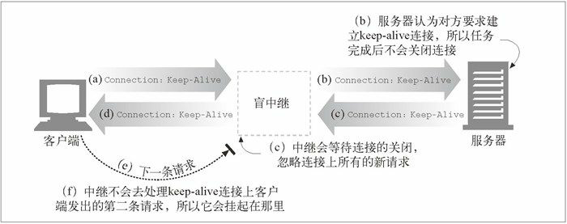

本文摘自书籍[《HTTP 权威指南》](https://www.amazon.cn/dp/B008XFDQ14/ref=sr_1_1?s=books&ie=UTF8&qid=1527513120&sr=1-1&keywords=http%E6%9D%83%E5%A8%81%E6%8C%87%E5%8D%97) 

## 中继

HTTP 中继（relay）是没有完全遵循 HTTP 规范的简单 HTTP 代理。中继负责处理 HTTP 中建立连接的部分，然后对字节进行盲转发。HTTP 很复杂，所以实现基本的代理功能并对流量进行盲转发，而且不执行任何首部和方法逻辑，有时是很有用的。盲中继很容易实现，所以有时会提供简单的过滤、诊断或内容转换功能。但这种方式可能潜在严重的互操作问题，所以部署的时候要特别小心。某些简单盲中继实现中存在的一个更常见（也更声名狼藉的）问题是，由于它们无法正确处理 Connection 首部，所以有潜在的挂起 keep-alive 连接的可能。

  

这张图中发生的情况如下所述：

- a 中，Web 客户端向中继发送了一条包含 Connection: Keep-Alive 首部的报文，如果可能的话要求建立一条 keep-alive 连接。客户端等待响应，以确定它要求建立 keep-alive 信道的请求是否被认可了。
- 中继收到了这条 HTTP 请求，但它并不理解 Connection 首部，因此会将报文一字不漏地沿着链路传递给服务器（参见图 8-14b）。但 Connection 首部是个逐跳首部；只适用于单条传输链路，是不应该沿着链路传送下去的。要有不好的事情发生了！
- b 中，经过中继转发的 HTTP 请求抵达 Web 服务器。当 Web 服务器收到经过代理转发的 Connection: Keep-Alive 首部时，会错误地认为中继（对服务器来说，它看起来就和其他客户端一样）要求进行 keep-alive 的对话！这对 Web 服务器来说没什么问题——它同意进行 keep-alive 对话，并在图c 中回送了一个 Connection: Keep-Alive 响应首部。那么，此时，Web 服务器就认为它是在与中继进行 keep-alive 对话，会遵循 keep-alive 对话的规则。但中继对 keep-alive 会话根本就一无所知。
- d 中，中继将 Web 服务器的响应报文，以及来自 Web 服务器的 Connection: Keep-Alive 首部一起发回给客户端。客户端看到这个首部，认为中继同意进行 keep-alive 对话。此时，客户端和服务器都认为它们是在进行 keep-alive 对话，但与它们进行对话的中继却根本不知道什么 keep-alive 对话。
- 中继对持久对话一无所知，所以它会将收到的所有数据都转发给客户端，等待原始服务器关闭连接。但原始服务器认为中继要求服务器将连接保持在活跃状态，所以是不会关闭连接的！这样，中继就会挂起，等待连接的关闭。
- d 中，当客户端收到回送的响应报文时，它会直接转向第二条请求，在 keep-alive 连接上向中继发送另一条请求。简单中继通常不会期待同一条连接上还会有另一条请求到达。

有一些方法可以使中继稍微智能一些，以消除这些风险，但所有简化的代理都存在着出现互操作性问题的风险。要为某个特定目标构建简单的 HTTP 中继，一定要特别注意其使用方法。对任何大规模部署来说，都要非常认真地考虑使用真正的、完全遵循 HTTP 的代理服务器。