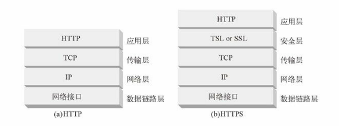

本文摘自书籍[《HTTP 权威指南》](https://www.amazon.cn/dp/B008XFDQ14/ref=sr_1_1?s=books&ie=UTF8&qid=1527513120&sr=1-1&keywords=http%E6%9D%83%E5%A8%81%E6%8C%87%E5%8D%97) 

## 安全 HTTP

提供认证（基本认证和摘要认证）和报文完整性检查（摘要 qop="auth-int"）的轻量级方法，对很多网络事务来说，这些方法都是很好用的，但对大规模的购物、银行事务，或者对访问机密数据来说，并不足够强大。这些更为重要的事务需要将 HTTP 和数字加密技术结合起来使用，才能确保安全。HTTP 的安全版本要高效、可移植且易于管理，不但能够适应不断变化的情况而且还应该能满足社会和政府的各项要求。我们需要一种能够提供下列功能的 HTTP 安全技术：

- 服务器认证（客户端知道它们是在与真正的而不是伪造的服务器通话）。
- 客户端认证（服务器知道它们是在与真正的而不是伪造的客户端通话）。
- 完整性（客户端和服务器的数据不会被修改）。
- 加密（客户端和服务器的对话是私密的，无需担心被窃听）。
- 效率（一个运行的足够快的算法，以便低端的客户端和服务器使用）。
- 普适性（基本上所有的客户端和服务器都支持这些协议）。
- 管理的可扩展性（在任何地方的任何人都可以立即进行安全通信）。
- 适应性（能够支持当前最知名的安全方法）。
- 在社会上的可行性（满足社会的政治文化需要）。

### HTTPS

HTTPS 是最流行的 HTTP 安全形式。它是由网景公司首创的，所有主要的浏览器和服务器都支持此协议。HTTPS 方案的 URL 以 https://，而不是 http:// 开头，据此就可以分辨某个 Web 页面是通过 HTTPS 而不是 HTTP 访问的。使用 HTTPS 时，所有的 HTTP 请求和响应数据在发送到网络之前，都要进行加密。HTTPS 在 HTTP 下面提供了一个传输级的密码安全层——可以使用 SSL，也可以使用其后继者——传输层安全（Transport Layer Security，TLS）。

  

大部分困难的编码及解码工作都是在 SSL 库中完成的，所以 Web 客户端和服务器在使用安全 HTTP 时无需过多地修改其协议处理逻辑。在大多数情况下，只需要用 SSL 的输入 / 输出调用取代 TCP 的调用，再增加其他几个调用来配置和管理安全信息就行了。

### 数字加密

- 密码

  对文本进行编码，使偷窥者无法识别的算法。

- 密钥

  改变密码行为的数字化参数。

- 对称密钥加密系统

  编 / 解码使用相同密钥的算法。

- 不对称密钥加密系统

  编 / 解码使用不同密钥的算法。

- 公开密钥加密系统

  一种能够使数百万计算机便捷地发送机密报文的系统。

- 数字签名

  用来验证报文未被伪造或篡改的校验和。

- 数字证书

  由一个可信的组织验证和签发的识别信息。

#### 密码

密码学基于一种名为密码（cipher）的秘密代码。密码是一套编码方案——一种特殊的报文编码方式和一种稍后使用的相应解码方式的结合体。加密之前的原始报文通常被称为明文（plaintext 或 cleartext）。使用了密码之后的编码报文通常被称作密文（ciphertext）。

#### 数字密码

随着数字计算的出现，出现了以下两个主要的进展：

- 从机械设备的速度和功能限制中解放出来，使复杂的编 / 解码算法成为可能。
- 支持超大密钥成为可能，这样就可以从一个加密算法中产生出数万亿的虚拟加密算法，由不同的密钥值来区分不同的算法。密钥越长，编码组合就越多，通过随机猜测密钥来破解代码就越困难。

数字密钥值是编 / 解码算法的输入。编码算法就是一些函数，这些函数会读取一块数据，并根据算法和密钥值对其进行编 / 解码。

### 对称密钥加密技术

很多数字加密算法都被称为对称密钥（symmetric-key）加密技术，这是因为它们在编码时使用的密钥值和解码时一样（e=d）。我们就将其统称为密钥 k。在对称密钥加密技术中，发送端和接收端要共享相同的密钥 k 才能进行通信。发送端用共享的密钥来加密报文，并将得到的密文发送给接收端。接收端收到密文，并对其应用解密函数和相同的共享密钥，恢复出原始的明文。

流行的对称密钥加密算法包括：DES、Triple-DES、RC2 和 RC4。

#### 密钥长度与枚举攻击

保持密钥的机密状态是很重要的。在很多情况下，编 / 解码算法都是众所周知的，因此密钥就是唯一保密的东西了。好的加密算法会迫使攻击者试遍每一个可能的密钥，才能破解代码。用暴力去尝试所有的密钥值称为枚举攻击（enumeration attack）。如果只有几种可能的密钥值，居心不良的人通过暴力遍历所有值，就能最终破解代码了。但如果有大量可能的密钥值，他可能就要花费数天、数年，甚至无限长的时间来遍历所有的密钥，去查找能够破解密码的那一个。

就对称密钥加密技术来说，通常所有的密钥值都是有效的。8 位的密钥只有 256 个可能的密钥值，40 位的密钥可以有 240 个可能的密钥值（大约是一万亿个密钥）。有些加密技术中只有部分密钥值是有效的。比如，在最知名的非对称加密算法 RSA 中，有效密钥 必须以某种方式与质数相关。可能的密钥值中只有少量密钥具备此特性。

在传统的对称密钥加密技术中，对小型的、不太重要的事务来说，40 位的密钥就足够安全了。

#### 建立共享密钥

对称密钥加密技术的缺点之一就是发送者和接收者在互相对话之前，一定要有一个共享的保密密钥。

### 公开密钥加密技术

公开密钥加密技术没有为每对主机使用单独的加密 / 解密密钥，而是使用了两个非对称密钥：一个用来对主机报文编码，另一个用来对主机报文解码。编码密钥是众所周知的（这也是公开密钥加密这个名字的由来），但只有主机才知道私有的解密密钥。这样，每个人都能找到某个特定主机的公开密钥，密钥的建立变得更加简单。但解码密钥是保密的，因此只有接收端才能对发送给它的报文进行解码。

通过公开密钥加密技术，全球所有的计算机用户就都可以使用安全协议了。制定标准化的公开密钥技术包是非常重要的，因此，大规模的公开密钥架构（Public-Key Infrastructure，PKI）标准创建工作已经开展十多年了。

#### RSA

所有公开密钥非对称加密系统所面临的共同挑战是，要确保即便有人拥有了下面所有的线索，也无法计算出保密的私有密钥：

- 公开密钥（是公有的，所有人都可以获得）；
- 一小片拦截下来的密文（可通过对网络的嗅探获取）；
- 一条报文及与之相关的密文（对任意一段文本运行加密器就可以得到）。

RSA 算法就是一个满足了所有这些条件的流行的公开密钥加密系统，它是在 MIT 发明的，后来由 RSA 数据安全公司将其商业化。即使有了公共密钥、任意一段明文、用公共密钥对明文编码之后得到的相关密文、RSA 算法自身，甚至 RSA 实现的源代码，破解代码找到相应的私有密钥的难度仍相当于对一个极大的数进行质因数分解的困难程度，这种计算被认为是所有计算机科学中最难的问题之一。因此，如果你发现了一种能够快速地将一个极大的数字分解为质因数的方法，就不仅能够入侵瑞士银行的账户系统，而且还可以获得图灵奖了。

RSA 加密技术的细节中包括很多繁琐的数学问题，我们的介绍不会那么深入。你不需要拥有数论方面的博士学位，有大量的库可以用来执行 RSA 算法。

#### 混合加密系统和会话密钥

任何人只要知道了其公开密钥，就可以向一台公共服务器发送安全报文，所以非对称的公开密钥加密系统是很好用的。两个节点无须为了进行安全的通信而先交换私有密钥。

但公开密钥加密算法的计算可能会很慢。实际上它混合使用了对称和非对称策略。比如，比较常见的做法是在两节点间通过便捷的公开密钥加密技术建立起安全通信，然后再用那条安全的通道产生并发送临时的随机对称密钥，通过更快的对称加密技术对其余的数据进行加密。

### 数字签名

除了加 / 解密报文之外，还可以用加密系统对报文进行签名（sign），以说明是谁编写的报文，同时证明报文未被篡改过。这种技术被称为数字签名（digital signing）。

#### 签名是加了密的校验和

数字签名是附加在报文上的特殊加密校验码。使用数字签名有以下两个好处：

- 签名可以证明是作者编写了这条报文。只有作者才会有最机密的私有密钥，因此，只有作者才能计算出这些校验和。校验和就像来自作者的个人“签名”一样。
- 签名可以防止报文被篡改。如果有恶意攻击者在报文传输过程中对其进行了修改，校验和就不再匹配了。由于校验和只有作者保密的私有密钥才能产生，所以攻击者无法为篡改了的报文伪造出正确的校验码。

数字签名通常是用非对称公开密钥技术产生的。因为只有所有者才知道其私有密钥，所以可以将作者的私有密钥当作一种“指纹”使用。

### 数字证书

因特网上的“ID 卡”——数字证书。数字证书中包含了由某个受信任组织担保的用户或公司的相关信息。

#### 证书的主要内容

数字证书中还包含一组信息，所有这些信息都是由一个官方的“证书颁发机构”以数字方式签发的。基本的数字证书中通常包含一些纸质 ID 中常见的内容，比如：

- 对象的名称（人、服务器、组织等）
- 过期时间
- 证书发布者（由谁为证书担保）
- 来自证书发布者的数字签名

而且，数字证书通常还包括对象的公开密钥，以及对象和所用签名算法的描述性信息。任何人都可以创建一个数字证书，但并不是所有人都能够获得受人尊敬的签发权，从而为证书信息担保，并用其私有密钥签发证书。

#### 用证书对服务器进行认证

通过 HTTPS 建立了一个安全 Web 事务之后，现代的浏览器都会自动获取所连接服务器的数字证书。如果服务器没有证书，安全连接就会失败。服务器证书中包含很多字段，其中包括：

- Web 站点的名称和主机名
- Web 站点的公开密钥
- 签名颁发机构的名称
- 来自签名颁发机构的签名

浏览器收到证书时会对签名颁发机构进行检查。如果这个机构是个很有权威的公共签名机构，浏览器可能已经知道其公开密钥了（浏览器会预先安装很多签名颁发机构的证书）。如果对签名颁发机构一无所知，浏览器就无法确定是否应该信任这个签名颁发机构，它通常会向用户显示一个对话框，看看他是否相信这个签名发布者。

### HTTPS 概述

HTTPS 就是在安全的传输层上发送的 HTTP。HTTPS 没有将未加密的 HTTP 报文发送给TCP，并通过世界范围内的因特网进行传输，它在将 HTTP 报文发送给 TCP 之前，先将其发送给了一个安全层，对其进行加密。HTTP 安全层是通过 SSL 及其现代替代协议 TLS 来实现的。

#### HTTPS 方案

请求一个客户端（比如 Web 浏览器）对某 Web 资源执行某事务时，它会去检查 URL 的方案：

- 如果 URL 的方案为 http，客户端就会打开一条到服务器端口 80（默认情况下）的连接，并向其发送老的 HTTP 命令。
- 如果 URL 的方案为 https，客户端就会打开一条到服务器端口 443（默认情况下）的连接，然后与服务器“握手”，以二进制格式与服务器交换一些 SSL 安全参数，附上加密的 HTTP 命令。

SSL 是个二进制协议，与 HTTP 完全不同，其流量是承载在另一个端口上的（SSL 通常是由端口 443 承载的）。如果 SSL 和 HTTP 流量都从端口 80 到达，大部分 Web 服务器会将二进制 SSL 流量理解为错误的 HTTP 并关闭连接。将安全服务进一步整合到 HTTP 层中去就无需使用多个目的端口了，在实际中这样不会引发严重的问题。

#### 建立安全传输

在未加密 HTTP 中，客户端会打开一条到 Web 服务器端口 80 的 TCP 连接，发送一条请求报文，接收一条响应报文，关闭连接。由于 SSL 安全层的存在，HTTPS 中这个过程会略微复杂一些。在 HTTPS 中，客户端首先打开一条到 Web 服务器端口 443（安全 HTTP 的默认端口）的连接。一旦建立了 TCP 连接，客户端和服务器就会初始化 SSL 层，对加密参数进行沟通，并交换密钥。握手完成之后，SSL 初始化就完成了，客户端就可以将请求报文发送给安全层了。在将这些报文发送给 TCP 之前，要先对其进行加密。

#### SSL握手

在发送已加密的 HTTP 报文之前，客户端和服务器要进行一次 SSL 握手，在这个握手过程中，它们要完成以下工作：

- 交换协议版本号
- 选择一个两端都了解的密码
- 对两端的身份进行认证
- 生成临时的会话密钥，以便加密信道

在通过网络传输任何已加密的 HTTP 数据之前，SSL 已经发送了一组握手数据来建立通信连接了。

#### 服务器证书

SSL 支持双向认证，将服务器证书承载回客户端，再将客户端的证书回送给服务器。而现在，浏览时并不经常使用客户端证书。大部分用户甚至都没有自己的客户端证书。服务器可以要求使用客户端证书，但实际中很少出现这种情况。

另一方面，安全 HTTPS 事务总是要求使用服务器证书的。在一个 Web 服务器上执行安全事务，比如提交信用卡信息时，你总是希望是在与你所认为的那个组织对话。由知名权威机构签发的服务器证书可以帮助你在发送信用卡或私人信息之前评估你对服务器的信任度。

服务器证书是一个显示了组织的名称、地址、服务器 DNS 域名以及其他信息的 X.509 v3 派生证书。

#### 站点证书的有效性

SSL 自身不要求用户检查 Web 服务器证书，但大部分现代浏览器都会对证书进行简单的完整性检查，并为用户提供进行进一步彻查的手段。网景公司提出的一种 Web 服务器证书有效性算法是大部分浏览器有效性验证技术的基础。验证步骤如下：

- 日期检测

  首先，浏览器检查证书的起始日期和结束日期，以确保证书仍然有效。如果证书过期了，或者还未被激活，则证书有效性验证失败，浏览器显示一条错误信息。

- 签名颁发者可信度检测

  每个证书都是由某些证书颁发机构（CA）签发的，它们负责为服务器担保。证书有不同的等级，每种证书都要求不同级别的背景验证。比如，如果申请某个电子商务服务器证书，通常需要提供一个营业的合法证明。

- 签名检测

  一旦判定签名授权是可信的，浏览器就要对签名使用签名颁发机构的公开密钥，并将其与校验码进行比较，以查看证书的完整性。

- 站点身份检测

  为防止服务器复制其他人的证书，或拦截其他人的流量，大部分浏览器都会试着去验证证书中的域名与它们所对话的服务器的域名是否匹配。服务器证书中通常都包含一个域名，但有些 CA 会为一组或一群服务器创建一些包含了服务器名称列表或通配域名的证书。如果主机名与证书中的标识符不匹配，面向用户的客户端要么就去通知用户，要么就以表示证书不正确的差错报文来终止连接。