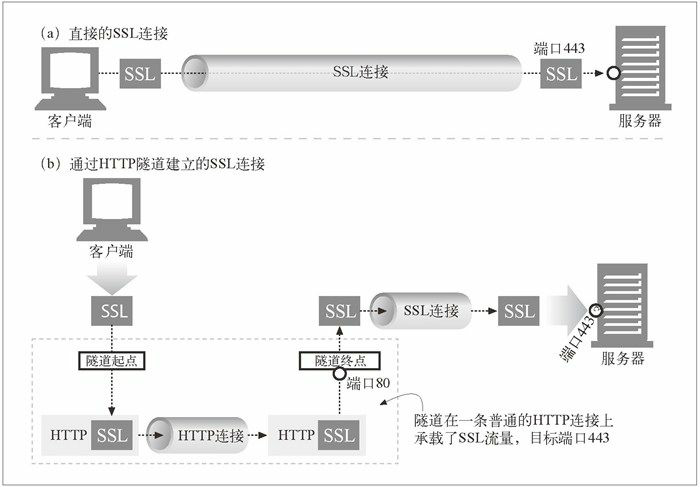

本文摘自书籍[《HTTP 权威指南》](https://www.amazon.cn/dp/B008XFDQ14/ref=sr_1_1?s=books&ie=UTF8&qid=1527513120&sr=1-1&keywords=http%E6%9D%83%E5%A8%81%E6%8C%87%E5%8D%97) 

## 隧道

可以通过 HTTP 应用程序访问使用非 HTTP 协议的应用程序。Web 隧道允许用户通过 HTTP 连接发送非 HTTP 流量，这样就可以在 HTTP 上捎带其他协议数据了。使用 Web 隧道最常见的原因就是要在 HTTP 连接中嵌入非 HTTP 流量，这样，这类流量就可以穿过只允许 Web 流量通过的防火墙了。

### 用CONNECT建立HTTP隧道

Web 隧道是用 HTTP 的 CONNECT 方法建立起来的。CONNECT 方法并不是 HTTP/1.1 核心规范的一部分，但却是一种得到广泛应用的扩展。CONNECT 方法请求隧道网关创建一条到达任意目的服务器和端口的 TCP 连接，并对客户端和服务器之间的后继数据进行盲转发。

  

- a 中，客户端发送了一条 CONNECT 请求给隧道网关。客户端的 CONNECT 方法请求隧道网关打开一条 TCP 连接。
- 一旦建立了 TCP 连接，网关就会发送一条 HTTP 200 Connection Established 响应来通知客户端。
- 此时，隧道就建立起来了。客户端通过 HTTP 隧道发送的所有数据都会被直接转发给输出 TCP 连接，服务器发送的所有数据都会通过 HTTP 隧道转发给客户端。

#### CONNECT请求

除了起始行之外，CONNECT 的语法与其他 HTTP 方法类似。一个后面跟着冒号和端口号的主机名取代了请求 URI。主机和端口都必须指定：

```http
CONNECT home.netscape.com:443 HTTP/1.0
```

和其他 HTTP 报文一样，起始行之后，有零个或多个 HTTP 请求首部字段。这些行照例以 CRLF 结尾，首部列表以一个仅有 CRLF 的空行结束。

#### CONNECT响应

发送了请求之后，客户端会等待来自网关的响应。和普通 HTTP 报文一样，响应码 200 表示成功。按照惯例，响应中的原因短语通常被设置为“Connection Established”：

```http
HTTP/1.0 200 Connection Established
```

与普通 HTTP 响应不同，这个响应并不需要包含 Content-Type 首部。此时连接只是对原始字节进行转接，不再是报文的承载者，所以不需要使用内容类型了。

### 数据隧道、定时及连接管理

管道化数据对网关是不透明的，所以网关不能对分组的顺序和分组流作任何假设。一旦隧道建立起来了，数据就可以在任意时间流向任意方向了。（隧道的两端（客户端和网关）必须做好在任意时刻接收来自连接任一端分组的准备，而且必须将数据立即转发出去。由于隧道化协议中可能包含了数据的依赖关系，所以隧道的任一端都不能忽略输入数据。隧道一端对数据的消耗不足可能会将隧道另一端的数据生产者挂起，造成死锁。）

作为一种性能优化方法，允许客户端在发送了 CONNECT 请求之后，接收响应之前，发送隧道数据。这样可以更快地将数据发送给服务器，但这就意味着网关必须能够正确处理跟在请求之后的数据。尤其是，网关不能假设网络 I/O 请求只会返回首部数据，网关必须确保在连接准备就绪时，将与首部一同读进来的数据发送给服务器。在请求之后以管道方式发送数据的客户端，如果发现回送的响应是认证请求，或者其他非 200 但不致命的错误状态，就必须做好重发请求数据的准备。传送的数据不要超过请求 TCP 分组的剩余容量。如果在收到所有管道化传输的 TCP 分组之前，网关关闭了连接，那么，管道化传输的多余数据就会使客户端 TCP 重置。TCP 重置会使客户端丢失收到的网关响应，这样客户端就无法分辨错误是由于网络错误、访问控制，还是认证请求造成的了。

### SSL隧道

最初开发 Web 隧道是为了通过防火墙来传输加密的 SSL 流量。很多组织都会将所有流量通过分组过滤路由器和代理服务器以隧道方式传输，以提升安全性。但有些协议，比如加密 SSL，其信息是加密的，无法通过传统的代理服务器转发。隧道会通过一条 HTTP 连接来传输 SSL 流量，以穿过端口 80 的 HTTP 防火墙。

  

为了让 SSL 流量经现存的代理防火墙进行传输，HTTP 中添加了一项隧道特性，在此特性中，可以将原始的加密数据放在 HTTP 报文中，通过普通的 HTTP 信道传送。直接的 SSL 连接与隧道化 SSL 连接的对比：

  

a 中，SSL 流量被直接发送给了一个（SSL 端口 443 上的）安全 Web 服务器。b 中，SSL 流量被封装到一条 HTTP 报文中，并通过 HTTP 端口 80 上的连接发送，最后被解封装为普通的 SSL 连接。

通常会用隧道将非 HTTP 流量传过端口过滤防火墙。这一点可以得到很好的利用，比如，通过防火墙传输安全 SSL 流量。但是，这项特性可能会被滥用，使得恶意协议通过 HTTP 隧道流入某个组织内部。

### SSL隧道与HTTP/HTTPS网关的对比

可以像其他协议一样，对 HTTPS 协议（SSL 上的 HTTP）进行网关操作：由网关（而不是客户端）初始化与远端 HTTPS 服务器的 SSL 会话，然后代表客户端执行 HTTPS 事务。响应会由代理接收并解密，然后通过（不安全的）HTTP 传送给客户端。这种方式有几个缺点：

- 客户端到网关之间的连接是普通的非安全 HTTP
- 尽管代理是已认证主体，但客户端无法对远端服务器执行 SSL 客户端认证（基于 X509 证书的认证）
- 网关要支持完整的 SSL 实现

对于 SSL 隧道机制来说，无需在代理中实现 SSL。SSL 会话是建立在产生请求的客户端和目的（安全的）Web 服务器之间的，中间的代理服务器只是将加密数据经过隧道传输，并不会在安全事务中扮演其他的角色。

### 隧道认证

在适当的情况下，也可以将 HTTP 的其他特性与隧道配合使用。尤其是，可以将代理的认证支持与隧道配合使用，对客户端使用隧道的权利进行认证:

  

### 隧道的安全性考虑

总的来说，隧道网关无法验证目前使用的协议是否就是它原本打算经过隧道传输的协议。因此，比如说，一些喜欢捣乱的用户可能会通过本打算用于 SSL 的隧道，越过公司防火墙传递因特网游戏流量，而恶意用户可能会用隧道打开 Telnet 会话，或用隧道绕过公司的 E-mail 扫描器来发送 E-mail。为了降低对隧道的滥用，网关应该只为特定的知名端口，比如 HTTPS 的端口 443，打开隧道。