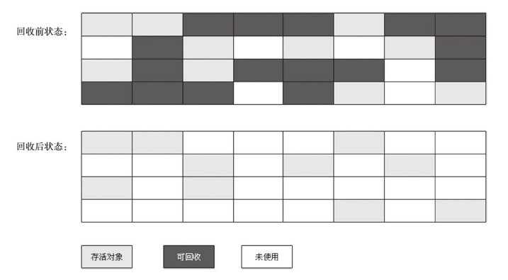

本文摘自书籍[《深入理解Java虚拟机：JVM高级特性与最佳实践》](https://www.amazon.cn/dp/B00DA0E170/ref=sr_1_1_twi_kin_2?s=books&ie=UTF8&qid=1528283344&sr=1-1&keywords=%E6%B7%B1%E5%85%A5%E7%90%86%E8%A7%A3java%E8%99%9A%E6%8B%9F%E6%9C%BA) 

## 垃圾回收算法

### 分代收集算法

当前商业虚拟机的垃圾收集都采用“分代收集”算法，这种算法根据对象的存活周期不同将内存划分为几块，一般把Java 堆分为：新生代、老年代。这样可以根据各个年代的特点采用最适当的收集算法。

1）新生代

每次垃圾收集时都发现大量的对象死去，只有少量存活。

2）老年代

对象存活率高。

### 标记 - 清除算法

最基础的收集算法，算法分为标记、清除两个阶段：首先标记出所有需要回收的对象，在标记完成后统一回收所有被标记的对象，它的标记过程如前一节的两次标记。

#### 缺点

1）效率低

2）标记清除后会产生大量连续的内存碎片，空间碎片太多可能会导致当程序在以后的运行过程中需要分配较大对象时无法找到足够的连续内存而不得不提前粗发另一次GC动作。

### 复制收集算法

将可用内存按容量划分为大小相等的两块，每次只使用其中的一块。当这一块的内存用完了，就将还存活着的对象复制到另一块上面，然后再把已使用过的内存空间一次清理掉。这样使得每次都是对其中的一块进行内存回收，内存分配时也就不用考虑内存碎片的问题了。

#### 缺点

将内存缩小为原来的一半。

#### 复制算法分区

复制算法被大量的商业虚拟机使用来回收新生代，新生代中的对象百分之九十八都是朝生夕死的，所以不需要按照1:1的比例来划分内存空间，而是将内存划分为较大的Eden空间和两块娇小的Survivor 空间，每次使用Eden和其中一块Survivor。当回收时，将Eden和Survivor中还存活着的对象一次性拷贝到另外一块Survivor空间上，最后清理掉Eden和刚才用过的Survivor的空间。HotSpot虚拟机默认Eden 和Survivor的大小比例为8:1，也就是新生代中可用内存空间为整个新生代容量的90%。但是若一轮回收后存活对象大于10%呢？此时Survivor是装不下这些存活对象的，那么就需要依赖其它内存（老年代）进行分配担保。

#### 缺点

执行较多的复制操作，效率降低。且算法适用于回收率高的内存空间，老年代这类回收率低的内存区域不适用使用该算法。

### 标记 - 整理算法

前面提到老年代不适合使用复制收集算法，人们提出了标记 - 整理算法来解决老年代GC的问题。算法分为两个步骤：

1）标记

同标记 - 清除算法的标记过程。

2）整理

将所有存活对象一项内存空间的一端，然后直接清理存活对象结束内存位置以后的内存空间。