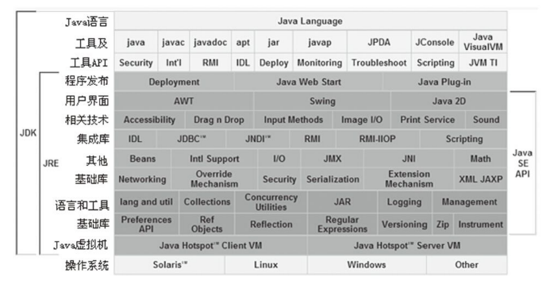

本文摘自书籍[《深入理解Java虚拟机：JVM高级特性与最佳实践》](https://www.amazon.cn/dp/B00DA0E170/ref=sr_1_1_twi_kin_2?s=books&ie=UTF8&qid=1528283344&sr=1-1&keywords=%E6%B7%B1%E5%85%A5%E7%90%86%E8%A7%A3java%E8%99%9A%E6%8B%9F%E6%9C%BA) 

## Java

### 概述

Java 不仅仅是一门编程语言，还是一个由一系列计算机软件和规范形成的技术体系，这个技术体系提供了完整的用于软件开发和跨平台部署的支持环境，并广泛应用于嵌入式系统、移动终端、企业服务器核大型机等各种场合。Java 能获得如此广泛的认可，除了因为它拥有一门结构严谨、面向对象的编程语言外，还有许多不可忽视的优点：

1）摆脱了硬件平台束缚，实现“一次编写，到处运行”的理想。

2）提供了一种相对安全的内存管理和访问机制，避免了绝大部分的内存泄露和指针越界问题。

3）实现了热点代码检测和运行时编译及优化。这使得Java 应用能随着运行时间的增加而获得更高的性能。

4）有一套完善的应用程序接口，还有无数的来自商业机构和开源社区的第三方类库，使得开发效率得到了很大的提升。

### 技术体系

1）Java程序设计语言

2）硬件平台上的Java 虚拟机

3）Class 文件格式

4）Java API 类库

5）商业机构和开源社区的第三方类库

### 根据各个组成部分的功能划分

#### JDK (Java Development Kit)

可以把 Java程序设计语言、Java虚拟机、Java API类库这三部分称为 JDK，JDK 是用于支持Java程序开发的最小环境。

#### JRE (Java Runtime Environment)

Java 程序运行的标准环境。

### 根据技术所服务领域划分

#### 1）Java Card

支持一些Java 小程序（Applets） 运行在小内存设备（如智能卡）上的平台。

#### 2）Java ME (Micro Edition)

支持Java程序运行在移动终端（手机、PDA）上的平台。对Java API 有所精简，并加入了针对移动终端的支持，也称为J2ME。

#### 3）JAVA SE（Standard Edition）

支持面向桌面级应用（如Windows下的应用程序）的Java 平台，提供了完整的Java 核心API，这个版本以前称为J2SE。

#### Java EE（Enterprise Edition）

支持使用多层架构的企业应用（如：ERP、CRM应用）的Java 平台，除了提供Java SE API 外，还对齐做了大量的扩充并提供了相关的部署支持，以前称为J2EE。

