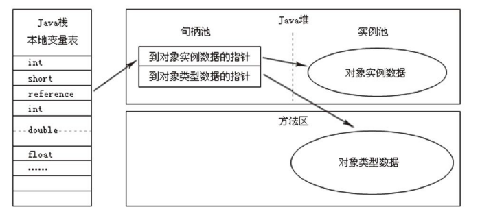
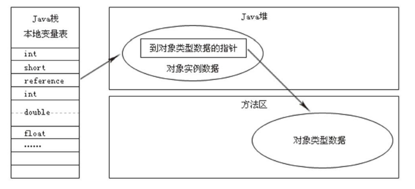

本文摘自书籍[《深入理解Java虚拟机：JVM高级特性与最佳实践》](https://www.amazon.cn/dp/B00DA0E170/ref=sr_1_1_twi_kin_2?s=books&ie=UTF8&qid=1528283344&sr=1-1&keywords=%E6%B7%B1%E5%85%A5%E7%90%86%E8%A7%A3java%E8%99%9A%E6%8B%9F%E6%9C%BA) 

## 对象访问

Java 中，对象访问是如何进行的？对象访问无处不在，是最普通的程序行为，但即使最简单的访问，也涉及栈、堆、方法区这单个最重要的内存区域之间的关联关系。

### 对象如何访问

如下面这句代码：

```java
Object object = new Object();
```

假设这句代码出现在方法体中，那么`Object object` 这部分将会反映到栈的本地变量表中，作为一个引用类型数据出现。而`new Object()` 这部分的语义将反映到堆中，形成一块存储了Object 类型所有实例数据值的结构化内存，另外，堆中必须包含能查找到此对象类型数据的地址信息，这些类型数据则存储在方法区中（数据类型数据：对象类型、父类、实现的接口、方法等）。

#### 对象访问方式

1）句柄访问方式

Java 堆中将会划分出一块内存来作为句柄池，引用中存储的就是对象的句柄地址，而句柄中包含了对象实例数据和类型数据各自的具体地址信息。



2）直接指针访问方式

Java 堆对象的布局中必须考虑如何放置访问类型数据的相关信息，引用中直接存储对象地址。



使用句柄访问方式好处：引用中存储的是稳定的句柄地址，在对象被移动（GC时，移动对象）时只会改变句柄中的实例数据指针，而引用本身不需要被修改。

使用直接访问方式好处：速度快，节省了一次指针定位的时间开销。

