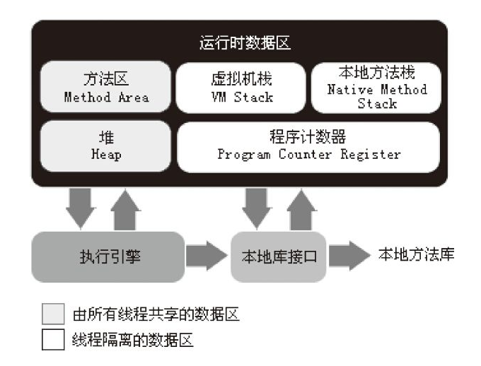

本文摘自书籍[《深入理解Java虚拟机：JVM高级特性与最佳实践》](https://www.amazon.cn/dp/B00DA0E170/ref=sr_1_1_twi_kin_2?s=books&ie=UTF8&qid=1528283344&sr=1-1&keywords=%E6%B7%B1%E5%85%A5%E7%90%86%E8%A7%A3java%E8%99%9A%E6%8B%9F%E6%9C%BA) 

## Java 运行时数据区

对于Java程序员来说，在虚拟机的自动内存管理机制的帮助下，不再需要为每个new操作去写配对的delete、free代码，而且不容易出现内存泄露和内存溢出问题，不过，正是因为内存控制的权利交给了虚拟机，所以一旦出现了内存泄露金额溢出方面的问题，如果不了解虚拟机是怎么使用内存的，那么排查错误将会成为一项异常艰难的工作。

### 概述

Java虚拟机在执行Java程序的过程中把它所管理的内存划分为若干不同的数据区域。这些区域都有各自的用途，以及创建和销毁的时间，有的区域随着虚拟机进程的启动而存在，有些区域则是依赖用户线程的启动和结束而建立和销毁。运行时数据区分为以下几个部分：

1）方法区

2）虚拟机栈

3）本地方法栈

4）Java 堆

5）程序计数器



### 程序计数器

程序计数器是一块较小的内存空间，它的作用可以看做是当前线程所执行的字节码的行号指示器。在虚拟机的概念模型中（仅是概念模型，各种虚拟机可能会通过一些更高效的方式实现），字节码解释器工作时就是通过改变这个计数器的值来选取下一条需要执行的字节码指令，分支、循环、跳转、异常处理、线程恢复等基础功能都需要你依赖这个计数器来完成。

由于Java虚拟机的多线程是通过线程轮流切换并分配处理器执行时间的方式实现的，在任何一个确定的时刻，一个处理器（对于多核处理器来说是一个内核）只会执行一条线程中的指令，因此为了线程切换后能恢复到正确的执行位置，每个线程都需要有一个独立的程序计数器，各条线程之间的计数器互不影响，独立存储，我们称这类内存区域为“线程私有”的内存。

如果线程正在执行的是一个Java方法，这个计数器记录的是正在执行的虚拟机字节码指令的地址；若正在执行的是Native方法，这个计数器值则为空（Undefined）。此内存区域时唯一一个再Java虚拟机规范中没有规定任何`OutOfMemoryError`情况的区域。

### 虚拟机栈

线程私有，它的生命周期与线程相同。虚拟机描述的是Java 方法执行的内存模型：每个方法被执行的时候都会同时创建一个栈帧用于存储局部变量表、操作栈、动态链接、方法出口等信息。每个方法被调用直至执行完成的过程，就对应着一个栈帧在虚拟机展中从入栈到出栈的过程。

#### 局部变量表

存放了编译期可知的各种基本数据类型、对象引用、returnAddress类型。局部变量表所需的内存空间在编译期间完成分配，当进入一个方法时，这个方法需要在帧中分配多大的局部变量空间是完全确定的，在方法运行期间不会改变局部变量表的大小。

1）基本数据类型

boolean、byte、char、short、int、float、long、double；其中64位的long、double类型数据占用2个局部变量空间（Slot），其余数据类型占一个Slot。

2）引用类型

reference 类型，不同于对象本身，根据不同的虚拟机实现，它可能是一个指向对象起始地址的引用指针，也可能指向一个代表对象的句柄或者其它与此对象相关的位置。

3）returnAddress 类型

指向了一条字节码指令的地址。

#### 涉及异常

1）StackOverflowError

当线程请求的栈深度大于虚拟机所允许的深度时，抛出此异常。

2）OutOfMemoryError

若虚拟机栈可以动态扩展（当前大部分Java 虚拟机都可以动态扩展，但Java虚拟机规范允许固定长度的虚拟机栈）时，扩展时无法申请足够的内存时抛出此异常。

### 本地方法栈

线程私有，本地方法栈与虚拟机栈发挥的作用相似，其区别是虚拟栈为虚拟机执行Java 方法服务，而本地方法栈则是为虚拟机使用Native 方法服务。虚拟机规范中对本地方法栈中的方法使用的语言、使用方式、数据结构没有强制规定。

#### 涉及异常

同虚拟机栈：StackOverflowError、OutOfMemoryError。

### Java 堆

线程共享的一块内存区域，在虚拟机启动时创建。此内存区域的唯一目的就是存放对象实例，几乎所有的对象实例、数组都在这里分配内存。但是由于JIT编译器的发展与逃逸分析技术的逐渐成熟，栈上分配、标量替换优化技术导致对象都分配在堆上渐渐变得不是那么“绝对”了。

#### GC 堆

堆是垃圾收集器管理的主要区域，因此也被称为 GC 堆。如果从内存回收的角度看，由于现在收集器基本都采用分代收集算法，所以堆中还可以细分为：新生代、老年代；再细致一点：Eden空间、From Survivor空间、To Survivor 空间等。按内存分配的角度看，线程共享的堆中可能划分出多个线程私有的分配缓冲区（TLAB）。无论怎么划分，存储的任然是对象实例，进一步划分是为了更好的回收内存，或者更快的分配内存。

#### 涉及异常

1）OutOfMemoryError

若对重没有内存完成实例分配，并且堆也无法再扩展，抛出此异常。

#### 控制参数

虚拟机规范对此区域的大小没有规定，可以是固定大小、也可以是可扩展的，当前主流的虚拟机都是可扩展的，控制参数：

```java
-Xmx -Xms
```

1）-Xmx

表示为堆分配的最大内存，动态分配。不会一开始就分配最大内存给堆区，而是根据需要动态扩展，若扩展时达到最大内存，而此时还需要更多的内存来存储对象实例，将会抛出`OutOfMemoryError`。

2）-Xms

表示为堆分配的最小内存，堆初始化内存大小。

### 方法区

线程共享的一块内存区域，它用于存储已被虚拟机加载的类信息、常量、静态变量、即时编译器编译后的代码等。HotSpot 虚拟机中把GC 分代收集扩展至了方法区，或者说是使用永久代来实现方法区，因此也被称为永久代（仅针对 HotSpot 虚拟机而言）。

虚拟机规范对此区域的垃圾回收未做限制，可以对此区域不实现垃圾回收，因为垃圾回收行为在这个区域时比较少出现的，但并非进入此区域的数据都是永久有效的，这个区域的回收目标主要是常量池的回收和对类型的卸载。

#### 涉及异常

1）OutOfMemoryError

当方法区无法满足内存分配需求时，将抛出此异常。

#### 运行时常量池

是方法区的一部分，Java 文件编译成class文件后，class文件中包含一项信息就是常量池，用于存放编译器生成的各种字面量、符号引用，这部分内容将在类加载后存放到方法区的运行时常量池中。运行时常量池不仅仅只能载入class文件中的常量池内容，还可以在运行期间放入常量，利用这种特性的方法有：String#intern() 方法，该方法会对调用了此方法的字符串对象与运行时常量池中的字符串对象比较，若相等则返回常量池中相等对象的引用，若无相等对象存在，则将该对象放入运行时常量池中，并返回对应的引用。

##### 涉及异常

1）OutOfMemoryError

当常量池无法申请到内存时，抛出此异常。

#### 控制参数

```java
-XX:PermSize
-XX:MaxPermSize
```

### 直接内存

直接内存不是虚拟机运行时数据区的一部分，也不是虚拟机规范中定义的内存区域，但是这部分内存也被频繁的使用，而且也可能导致`OutOfMemoryError`异常。

在JDK 1.4 中新加入了NIO 类，引入了一种基于通道与缓冲区的IO方式，可以使用Native 函数库直接分配堆外内存，然后通过一个存储在Java 堆的`DirectByteBuffer` 对象作为块内存的引用进行操作。这样能在一些场景中显著提高性能，因为避免了堆和Native 堆中来回复制数据。

显然，直接内存的分配不会受到Java 堆大小的限制，但是，既然是内存，则肯定还是会受到本机总内存的大小及处理器寻址空间的限制。若管理员配置虚拟机参数时忽略了直接内存，使得各个内存区域的总和大于本机物理内存，将会导致`OutOfMemoryError`。

#### 控制参数

```java
-XX: MaxDirectMemorySize
```

