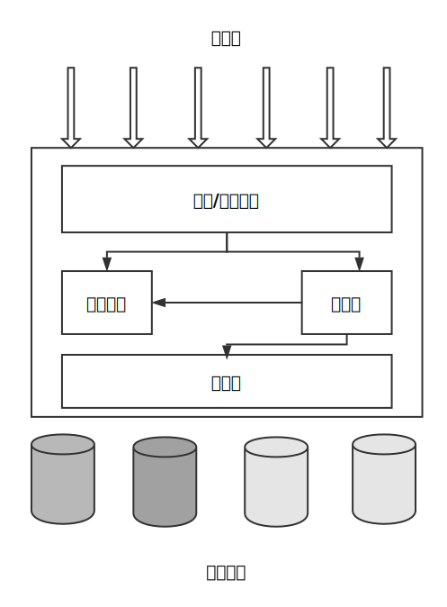

## MySQL 架构

### MySQL 逻辑架构

`MySQL` 逻辑架构图：



- 最上层的服务并不是 `MySQL`  独有的，大多数基于网络的客户端/ 服务器的工具或者服务都是类似的架构。
- 第二层架构是 `MySQL` 大多数的核心服务功能的一层，包括查询解析、分析、优化、缓存以及所有的内置函数，所有跨存储引擎的功能都在这一层实现：存储过程、触发器、视图等。
- 第三层包含了存储引擎。存储引擎负责 `MySQL` 中数据的存储和提取。每个存储引擎都有自己的优势和劣势。服务器通过 `API` 与存储引擎进行通信。这些接口屏蔽了不同存储引擎之间的差异，使得这些差异对上层的查询过程透明。存储引擎不会相互通信，也不会解析 `SQL`，而仅仅是简单的响应上层服务器的请求。

#### 连接管理与安全性

每个客户端连接都会在服务器进程中拥有一个线程，这个连接的查询只会在这个单独的线程中执行，该线程只能轮流在某个 `CPU` 核心或者 `CPU` 中运行。服务器会负责缓存线程，因此不需要为每一个新建的连接创建或者销毁线程。

当客户端连接到  `MySQL` 服务器时，服务器需要对其进行认证。认证基于用户名、原始主机信息和密码。如果使用了 `SSL` 连接，还可以使用 `X.589` 证书认证。一旦连接成功，服务器会继续验证客户端是否具有执行某个特定查询的权限。


#### 优化与执行

 `MySQL` 会解析查询，并创建内部数据结构（解析树），然后对其进行各种优化，包括重写查询、决定表的读取顺序以及选择合适的索引等。可通过特殊的关键字提示优化器，影响它的决策过程。也可以请求优化器解释优化过程的各个因素，便于用户重构查询和 `schema`、修改相关配置，使得应用尽可能高效运行。

优化器并不关心表使用的是什么存储引擎，但存储引擎对于优化查询是有影响的。优化器会请求存储引擎提供容量或某个具体操作的开销信息以及表数据的统计信息等。

对于 `SELECT` 语句，在解析查询之前，服务器会先检查查询缓存，如果能够在其中找到对应的查询，服务器就不必再执行查询解析、优化和执行的整个过程，而是直接返回查询缓存中的结果集。


### 并发控制

#### 读写锁

在处理并发读挥着写时，可以通过实现一个由两种类型的锁组成的锁系统来解决问题。这两种类型的锁通常被称为共享锁和排它锁，也叫读锁和写锁。

读锁是共享的，或者是相互不阻塞的。多个客户在同一时刻可以同时读取同一个资源，而互不干扰。

写锁时排它锁，也就是说一个写锁会阻塞其它的写锁和读锁，这是出于安全策略的考虑。

#### 锁粒度

一种提高共享资源并发性的方式就是让锁定对象更有选择性。尽量只锁定需要修改的数据，而不是所有的资源。更理想的是只对修改的数据片进行精确的锁定。

但是加锁需要消耗资源。锁的各种操作，如获取锁、释放锁等，都会增加系统的开销。如果系统花费大量的时间来管理锁，而不是存储数据，那么系统的性能可能会受到影响。

所谓的锁策略就是在锁的开销和数据的安全性之间需求一个平衡。 `MySQL` 中提供了多种选择，每种  `MySQL` 存储引擎都可以实现自己的锁策略和锁粒度。

#### 表锁

表锁是  `MySQL` 中最基本的锁策略，并且是开销最小的策略。表锁会锁定整张表，一个用户在对表进行写操作前，需要现获得写锁，这就会阻塞其他用户对该表的所有读写操作。另外写锁比读锁优先级高，因此可能写锁请求会插入到读锁队列的前面。

#### 行级锁

行级锁可以最大程度的支持并发处理，同时也带来了巨大的锁开销。行级锁只在存储引擎层实现，而  `MySQL` 服务器层没有实现。服务器层完全不了解存储引擎中的锁实现。


### 事务

事务就是一组原子性的 `SQL` 查询，或者说一个独立的工作单元。如果数据库引擎能够成功的对数据库应用该组查询的全部语句，那么就执行该组查询。也就是说事务内的语句，要么全部执行成功，要么全部执行失败。


#### ACID

- 原子性 - `atomicity`

  一个事务必须被视为一个不可分割的最小工作单元，整个事务中的所有操作要么全部提交成功，要么失败回滚。

- 一致性 - `consistency`

  数据库总是从一个一致性的状态转换到另外一个一致性的状态。

- 隔离性 - `isolation`

  一个事务所做的修改在最终提交以前，对其它事务是不可见的。

- 持久性 - `durability`

  一旦事务提交，则其所做的修改就会永久保存到数据库中。

就像锁粒度的升级会增加系统的开销一样，这种事务处理过程中额外的安全性，也需要数据库系统做更多的额外工作。一个实现了 `ACID` 的数据库相比于没有实现的数据库，通常会需要更强的 `CPU` 处理能力、更大的内存和更多的磁盘空间。用户可以根据业务是否需要事务处理来选择合适的存储引擎。对于一些不需要事务的查询类应用，选择一个非事务性的存储引擎可以获得更高的性能。


#### 隔离性级别

在 `SQL` 标准中定义了四种隔离级别，每一种级别都规定了一个事务中所做的修改，哪些在事务内和事务间是可见的，哪些是不可见的：

- 未提交读 - `READ UNCOMMITTED`

  在此级别，事务中的修改，即使没有提交，对其他事务也都是可见的。事务可以读取未提交的数据，这也被称为脏读。这个级别从性能上不会比其它级别好太多，但却缺乏其它级别的很多好处，所以应用很少。

- 提交读 - `READ COMMITEED`

  这是大多数数据库默认的隔离级别（`MySQL` 不是），此级别满足前面提到的隔离性的简单定义：一个事务从开始到提交之前，所做的修改对其他事务都是不可见的。这个级别有时候也叫做不可重复读，因为两次执行同样的查询，可能得到不一样的结果。

- 可重复读 - `REPEATABLE READ`

  解决了脏读的问题。该级别保证了在同一个事务中多次读取同样记录的结果是一致的。但是理论上，可重复读隔离级别还是无法解决另外一个幻读的问题。

- 可串行化 - `SERIALIZABLE`

  是最高的隔离级别。它通过强制事务串行执行，避免了前面的幻读的问题。简单来说，会在读取每一行数据上都加锁，所以可能导致大量的超时和锁争用的问题。


#### 死锁

死锁是指两个或者多个事务在一个资源上相互占用，并请求锁定对方占用的资源，从而导致恶心循环的现象。当多个事务试图以不同的顺序锁定资源时，就可能产生死锁。多个事务同时锁定同一个资源时，也会产生死锁，如：

```mysql
## 事务 1
start transaction;
update person set age=10 where sex='男' and age = 11;
update person set age=11 where sex='女' and age = 10;
commit;

## 事务 2
start transaction;
update person set high=10 where sex='女' and age = 10;
update person set high=11 where sex='男' and age = 11;
commit;
```

如果凑巧，两个事务都执行了第一条 `update` 语句，更新了一行数据，同时也锁定了该行数据，接着每个事务都尝试去执行第二条 `update` 语句，却发现改行已经被对方锁定，然后两个事务都等待对方释放锁，同时持有对方需要的锁，则陷入死循环。除非外部因素接入才可能解除死锁。

为了解决这种问题，数据库系统实现了各种死锁检测和死锁超时机制。越复杂的系统，比如 `InnoDB`存储引擎，越能检测到死锁的循环依赖，并立即返回一个错误。还有另一种解决办法，就是当查询时间达到锁等待超时的设定后放弃锁请求，这种方式通常来说不太好。

锁的行为和顺序是和存储引擎相关的。以同样的顺序执行语句，有些存储引擎会产生死锁，有些则不会。死锁的产生有双重原因：真正的数据冲突；由于存储引擎实现方式导致的。

死锁发生后，只能部分或者完全回滚其中一个事务，才能打破死锁。


#### 事务日志

事务日志可以帮助提高事务的效率，使用事务日志，存储引擎在修改表的数据时只需要修改其内存拷贝，再把该修改行为记录到持久在硬盘上的事务日志中，而不用每次都将修改的数据本身持久到磁盘。事务日志采用的是追加的方式，因此写日志的操作时磁盘上一小块区域内的顺序 `IO`，而不像随机 `IO` 需要在磁盘的多个地方移动磁头，所以采用事务日志的方式相对来说要快得多。事务日志持久以后，内存中被修改的数据在后台可以慢慢的刷会磁盘。

若数据的修改已经记录到了事务日志并持久化，但数据本身没有回写磁盘，此时系统崩溃，存储引擎在重启时能够自动恢复这部分数据。


#### MySQL 中的事务

`MySQL` 中提供了两种事务型的存储引擎：`InnoDB`、`NDB Cluster`。

- 自动提交

  `MySQL` 默认采用自动提交模式，也就是说如果不显式的开始一个事务，则每个查询都被当做一个事务执行提交操作。可以通过设置 `AUTOCOMMIT` 变量来启用或禁用自动提交模式：

  ```mysql
  set AUTOCOMMIT = 1;
  ```

  查看：

  ```mysql
  show variables like 'AUTOCOMMIT';
  ```

  当禁用时，所有的查询都在一个事务中，知道显式的执行 `COMMIT` 或者 `ROLLBACK` 回滚，该事务才结束，同时又开始了一个新的事务。另外还有一些命令会强制执行 `COMMIT` 提交当前的事务，如 `ALERT TABLE` 、`LOCK TABLES` 等语句。

  `MySQL` 可通过执行 `set transaction isolation level [level]` 命令来设置隔离级别。新的隔离级别会在下一个事务开始的时候生效。

- 在事务中混合使用存储引擎

  `MySQL` 服务器层不管理事务，事务由下层的存储引擎实现的，所以在同一个事务中，使用多种存储引擎是不可靠的。如果在事务中混合使用了事务型和非事务型的表（`InnoDB` 和 `MyISAM`），在正常提交的情况下不会有什么问题，但若事务需要回滚，非事务型的表上的变更就无法撤销，这回导致数据库处于不一致的状态，这种情况很难修复，事务的最终结果将无法确定。

  在非事务型的表上执行事务相关操作时，`MySQL` 通常不会发出提醒，也不会报错。

- 隐式和显式锁定

  `InnoDB` 采用的两阶段锁定协议。在事务执行过程中，随时都可以执行锁定，锁只有在执行 `COMMIT` 或 `ROLLBACK` 时才会释放，并且所有的锁是在同一时刻被释放。前面描述的是隐式锁定，`InnoDB` 会根据隔离级别在需要的时候自动加锁。另外 `InnoDB` 也支持通过特定的语句进行显示的锁定：

  ```mysql
  select ... lock in share mode;
  select ... for update;
  ```

  `InnoDB` 也支持 `Lock tables` 和 `unlock tables` 语句，这是在服务器层实现的，和存储引擎无关。他们有自己的用途，但并不能替代事务处理。

### 多版本并发控制

`MySQL` 的大多数事务型存储引擎的实现的都不是简单的行级锁。基于提升并发性能的考虑，他们一般都同时实现了多版本并发控制（`MVCC`）。不仅是 `MySQL`，包括 `Oracle`等其他数据库系统都实现了 `MVCC`，但各自的实现机制不同。

可以认为 `MVCC` 是行级锁的变种，但是它避免了很多情况下的加锁操作，因此开销更低。虽然实现机制有所不同，但是大都实现了非阻塞的读操作，写操作也只锁定必要的行。

`MVCC` 的实现是通过保存数据在某个时间点的快照来实现的。也就是说，不管需要执行多长时间，每个事务看到的数据都是一致的。根据事务开始的时间不同，每个事务对同一张表，同一时刻看到的数据可能不一样。

`InnoDB` 的 `MVCC`，是通过在每行记录后面保存两个隐藏的列来实现的。这两个列一个保存了行的创建时间，一个保存行的过期时间或删除时间。当然存储的并不是实际的时间，而是系统版本号。每开始一个新的事务，系统版本号都会自动递增。事务开始时刻的系统版本号会作为事务的版本号，用来和查询到的每行记录的版本号进行比较。下面是在 `REPEATABLE READ` 隔离级别下，`MVCC` 是如何操作的：

1）`select`

`InnoDB` 会根据以下两个条件检查每行记录：

- `InnoDB` 只查找版本早于当前事务版本的数据行（也就是行的系统版本号小于或等于事务的系统版本号），这样可以确保事务读取的行，要么是事务自身插入或者修改过的。
- 行的删除版本要么未定义，要么大于当前事务版本号。这可以确保事务读取到的行，在事务开始之前未被删除。

只有符合上诉两个条件的记录，才能返回作为查询结果。

2）`insert`

`InnoDB` 为新插入的每一行保存当前系统版本号作为行版本号。

3）`delete`

`InnoDB` 为删除的每一行保存当前系统版本号作为行删除标识。

4）`Update`

`InnoDB` 为插入一行新纪录，保存当前系统版本号作为行版本号，同时保存当前系统版本号到原来的行作为行删除标识。

保存这两个额外的系统版本号，使大多数读操作都可以不用加锁。这样设计使得读数据操作很简单，性能很好，并且也能保证只会读取符合标准的行。不足之处是每行记录都需要额外的存储空间。

`MVCC` 只在 `REPEATABLE READ` 与 `READ COMMITED` 两个隔离级别下工作。